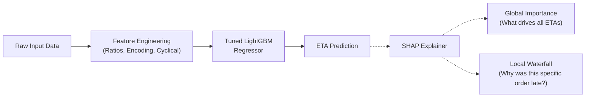

# DeliveryOps — Real-Time ETA Prediction & Logistics SLAs

[](https://foodops-delivery.streamlit.app/)
[](https://www.python.org/)
[](https://lightgbm.readthedocs.io/)
[](#5-model-architecture--benchmark-scoreboard)
[](#6-why-quantile-regression-over-rmse)
[](https://foodops-delivery.streamlit.app/)

**DeliveryOps** is the logistics and dispatch intelligence module of **FoodOps.AI**. It solves a critical marketplace challenge: predicting real-time food delivery ETAs and generating dynamic, customer-facing promised delivery windows.

Instead of treating delivery prediction as a standard mean-squared-error problem, DeliveryOps treats it as an **operations Service Level Agreement (SLA) problem**. By utilizing Gradient Boosted Trees and Asymmetric Pinball Loss, the engine generates an Expected ETA (P50), an Optimistic scenario (P10), and a Promised Delivery Time (P90) that guarantees reliable operational coverage even during peak congestion.

> 🚀 **Live Production Application:** [https://foodops-delivery.streamlit.app/](https://foodops-delivery.streamlit.app/)

---

## Table of Contents

1. [Executive Summary & Operational Context](#1-executive-summary--operational-context)
2. [Problem Formulation & Mathematical Framing](#2-problem-formulation--mathematical-framing)
3. [Dataset Architecture & Validation Strategy](#3-dataset-architecture--validation-strategy)
4. [Feature Engineering Pipeline](#4-feature-engineering-pipeline)
5. [Model Architecture & Benchmark Scoreboard](#5-model-architecture--benchmark-scoreboard)
6. [Why Quantile Regression Over RMSE](#6-why-quantile-regression-over-rmse)
7. [SHAP-Powered Explainability Engine](#7-shap-powered-explainability-engine)
8. [Interactive Streamlit Operations Dashboard](#8-interactive-streamlit-operations-dashboard)
9. [Repository & Module Directory Layout](#9-repository--module-directory-layout)
10. [Local Quickstart & Execution Guide](#10-local-quickstart--execution-guide)
11. [Logistics Insights & Business Takeaways](#11-logistics-insights--business-takeaways)

---

## 1. Executive Summary & Operational Context

In the food delivery ecosystem, setting a highly accurate Estimated Time of Arrival (ETA) directly impacts customer retention and unit economics:

- **The Cost of Under-Predicting:** Late deliveries lead to frustrated customers, negative reviews, and expensive customer support refunds.
- **The Cost of Over-Predicting:** Excessively conservative ETAs drive cart abandonment, as consumers switch to competing apps offering faster perceived service.

DeliveryOps solves this by transforming historical market telemetry, routing estimates, and kitchen loads into a calibrated prediction window. The module benchmarks multiple architectures (naive heuristics, linear models, and LightGBM) to select the champion model, which is then deployed into an interactive operations console for dispatch scenario simulation.

---

## 2. Problem Formulation & Mathematical Framing

- **Target Prediction:** Total delivery duration in seconds ($y$) from the exact moment of order placement to customer doorstep arrival.
- **Target Transformation:** Delivery times cannot be negative but exhibit a heavy right-skew (e.g., severe traffic, dropped orders). To stabilize variance and penalize relative rather than absolute magnitude errors, the target is log-transformed:
  
  $$y_{\log} = \log(1 + \text{total\_delivery\_duration})$$

- **Uncertainty Estimation (Quantile Loss):** Standard models predict the conditional mean. DeliveryOps predicts the 10th (P10), 50th (P50), and 90th (P90) percentiles using **Pinball Loss**. For a given quantile $\tau \in [0, 1]$:

  $$L_\tau(y, \hat{y}) = \begin{cases} \tau (y - \hat{y}) & \text{if } y \ge \hat{y} \\ (\tau - 1) (y - \hat{y}) & \text{if } y < \hat{y} \end{cases}$$

- **Inversion & Delivery Window:** Log predictions are exponentially inverted ($\exp(\hat{y}_{\log}) - 1$) and converted to minutes to present the customer with an SLA-compliant window (e.g., "35 to 50 minutes").

---

## 3. Dataset Architecture & Validation Strategy

The module leverages ~196k historical deliveries across 6 distinct operational markets, capturing real-time dasher telemetry and kitchen complexity.

- **Primary Dataset Source:** [DoorDash ETA Prediction (Kaggle)](https://www.kaggle.com/datasets/dharun4772/doordash-eta-prediction)

| Dataset Component | Scope / Dimensions | Key Attributes |
| :--- | :--- | :--- |
| **Logistics & Routing** | Order timestamps, geolocation proxies | `created_at`, `actual_delivery_time`, `estimated_store_to_consumer_driving_duration` |
| **Market Congestion** | Live dispatch telemetry | `total_onshift_dashers`, `total_busy_dashers`, `total_outstanding_orders` |
| **Order Complexity** | Restaurant and cart details | `store_id`, `store_primary_category`, `subtotal`, `num_distinct_items`, `order_protocol` |

### Leakage-Free Temporal Validation Split (Concept Drift)

Using a random $k$-fold split mixes future data into the past, causing catastrophic lookahead leakage. DeliveryOps enforces a **strict chronological hold-out**:


```

[=================== TRAINING SET: Jan 21 to Feb 10 ===================] [== TEST SET: Feb 11 to Feb 17 ==]
                                                                        ↑
                                                               Cutoff: 2015-02-11

```

- **The "Valentine's Day" Drift:** The test set deliberately includes February 14th—a massive anomaly day in the food industry causing unpredictable delays. This intentionally stress-tests the model against real-world concept drift, ensuring hyperparameter tuning heavily favors regularization over memorization.

---

## 4. Feature Engineering Pipeline

Engineered features are robust against edge cases and system blackouts, tracked in [`notebooks/feature_engineering.ipynb`](./notebooks/feature_engineering.ipynb):

1. **Timezone Alignment & Anomaly Truncation:**
   - Raw UTC timestamps were localized to `US/Pacific` to correctly map human diurnal patterns (e.g., a 6:00 PM local dinner rush).
   - Extreme duration anomalies (clock desynchronizations $\le 0$s and ghost orders $> 7200$s) were aggressively truncated.
2. **Market Strain & Congestion Ratios:**
   - `busy_dasher_ratio` and `outstanding_order_ratio`. Division-by-zero edge cases (when `onshift_dashers == 0`) were capped at $2 \times$ the 99th empirical percentile to preserve gradient stability while signaling peak distress.
3. **Probabilistic & Hierarchical Imputation:**
   - Missing dispatch `order_protocol` fields were imputed probabilistically by modeling $P(\text{protocol} \mid \text{duration\_bin})$, preserving multimodal automation spikes.
   - Missing `store_primary_category` tags were backfilled using a deterministic `store_id` mapping.
4. **Smoothed Target Encoding:**
   - High-cardinality restaurant categories were mapped to their average historical delivery times. Bayesian smoothing (weight=20) was applied to pull low-volume, rare cuisines toward the global mean, preventing severe overfitting.
5. **Cyclical Temporal Encodings:**
   - `order_hour` and `order_day_of_week` were converted to continuous sine/cosine pairs to maintain periodic continuity (e.g., 23:00 is mathematically adjacent to 00:00).

---

## 5. Model Architecture & Benchmark Scoreboard

Evaluated strictly on the unseen Valentine's Day week test set, minimizing Mean Absolute Error (MAE):

| Rank | Model Architecture | Family | Test MAE (min) | P90 SLA Coverage | Status | Key Characteristics |
| :---: | :--- | :--- | :---: | :---: | :---: | :--- |
| 🥇 | **Tuned LightGBM (P10/50/90)** | Gradient Boosted Trees | **10.29** | **86.70%** | **Champion (Deployed)** | Optuna Bayesian tuned (547 estimators). Heavy regularization (`subsample=0.92`, `colsample=0.89`) protects against holiday concept drift. |
| 🥈 | **Baseline LightGBM** | Gradient Boosted Trees | 10.31 | 87.49% | Challenger | Default hyperparameters. Slightly overfit to normal operational weeks. |
| 🥉 | **Ridge Regression** | L2-Regularized Linear Model | 10.89 | N/A | Linear Baseline | Pipeline with `StandardScaler` and `OneHotEncoder`. Proves engineered ratios hold strong linear signal. |
| 4 | **Naive Median Baseline** | Heuristic Benchmark | 13.08 | N/A | Lower Bound | Predicts the global median (44 min) for all orders. |

### Performance Analysis
- **10.29-Minute MAE:** The LightGBM engine shaves nearly 3 minutes of error off the naive baseline, a critical improvement for downstream dispatch efficiency.
- **P90 Operational Coverage:** The P90 quantile model ensures that roughly 87 times out of 100, a delivery arrives before or exactly at the outer boundary of the promised customer window, even during holiday-weekend stress tests.

---

## 6. Why Quantile Regression Over RMSE

Predicting a single conditional mean (or median) is dangerous for customer experience. If you predict the P50 (median) ETA, mathematically, **the food will be late 50% of the time.**

By swapping standard symmetric loss functions for **Asymmetric Pinball Loss**, we train three distinct LightGBM models simultaneously:
1. **P10 Model (Optimistic):** Heavy penalty for over-predicting. Learns the absolute "best-case scenario."
2. **P50 Model (Expected):** Symmetric MAE penalty. Used internally for Dasher routing.
3. **P90 Model (Promised):** Heavy penalty for under-predicting. The model intentionally "pads" the ETA based on specific order conditions to ensure we hit our delivery promise.

---

## 7. SHAP-Powered Explainability Engine

To ensure operational transparency and trust, **SHAP (SHapley Additive exPlanations)** is utilized to verify that the gradient boosting engine has learned the correct laws of supply and demand.



* **Global Importance:** `estimated_store_to_consumer_driving_duration` and `store_category_target_enc` universally dictate the baseline ETA.
* **Congestion Impact:** SHAP summary plots confirm that high values of `outstanding_order_ratio` positively push the prediction higher (increasing ETA), proving the model accurately captures network strain.

---

## 8. Interactive Streamlit Operations Dashboard

The interactive dispatch console is located at [`app/streamlit_app.py`](https://www.google.com/search?q=./app/streamlit_app.py&utm_source=gemini).

> 🌐 **Live Cloud Deployment:** [https://foodops-delivery.streamlit.app/](https://foodops-delivery.streamlit.app/)

### Application Features:

1. **Real-Time Delivery Permutations:** Adjust dasher availability, kitchen bottlenecks, and driving distances on the fly to see how the P10-to-P90 uncertainty window expands or contracts.
2. **Model Evaluation Scoreboard:** View validation KPIs (MAE, Coverage) and native LightGBM feature importance rankings.
3. **Fulfillment Network Analytics:** Analyze baseline delivery speeds by cuisine type and observe platform-wide daily dispatch volume trends.
4. **Resilient Production Architecture:** Uses a `joblib` bundle (`delivery_model_bundle.joblib`) that embeds target encoding maps and a strict input feature contract to prevent UI mismatches.

---

## 9. Repository & Module Directory Layout

```text
DeliveryOps/
├── README.md                          ← Comprehensive module documentation (this file)
├── app/
│   ├── streamlit_app.py               ← Interactive dispatch simulator & analytics UI
│   └── theme.py                       ← Dynamic light/dark theme tokens
├── data/
│   ├── raw/
│   │   └── historical_data.csv        ← Source DoorDash ETA dataset (~197k rows)
│   └── processed/
│       ├── cleaned_data.parquet       ← Sanitized data with imputed telemetry
│       ├── processed_data.parquet     ← Fully engineered feature matrix
│       └── operational_summary.json   ← Cached analytical aggregates for the UI
├── models/
│   └── delivery_model_bundle.joblib   ← Production bundle (P10/P50/P90 models + categorical maps)
├── notebooks/
│   ├── EDA.ipynb                      ← Target analysis & protocol distribution, Probabilistic imputation & missingness mapping, Timezone alignment & anomaly truncation
│   ├── feature_engineering.ipynb      ← Ratios, cyclical encodings, smoothed target encoding
│   └── model_training.ipynb           ← Optuna tuning, MAE benchmarking, and SHAP analysis
└── src/
    ├── data_loader.py                 ← Utilities to load metrics and JSON summaries
    └── inference.py                   ← Edge inference engine formatting UI inputs for LGBM

```

---

## 10. Local Quickstart & Execution Guide

### Prerequisites

* Python 3.10+ (tested on Python 3.12)
* Virtual environment (`venv` or `conda`)

### Step 1: Clone Repository & Create Environment

```bash
# Clone the repository
git clone [https://github.com/iamnitishsah/FoodOps.AI.git](https://github.com/iamnitishsah/FoodOps.AI.git)
cd FoodOps.AI

# Create and activate virtual environment
python3 -m venv .venv
source .venv/bin/activate    # On Windows: .venv\Scripts\activate

```

### Step 2: Install Dependencies

```bash
pip install --upgrade pip
pip install -r requirements.txt

```

### Step 3: Launch the Streamlit Dashboard

```bash
cd DeliveryOps
streamlit run app/streamlit_app.py

```

The application will automatically initialize and open in your browser at `http://localhost:8501`.

---

## 11. Logistics Insights & Business Takeaways

1. **Concept Drift & Holiday Vulnerability:** The model experienced a noticeable performance dip when evaluated on Valentine's Day week. High-stress holidays fundamentally alter dispatch mathematics. Relying on heavy hyperparameter regularization (high `min_child_samples`, aggressive feature subsampling) prevents catastrophic failure during these black-swan events.
2. **Missing Telemetry as a Signal:** System dropouts (like the 85% missing Dasher telemetry in Market 6) carry predictive weight. Rather than dropping these rows, utilizing domain-aware imputation and explicit `_imputed` flags allows tree algorithms to widen their uncertainty intervals when flying blind.
3. **Target Encoding Beats One-Hot Encoding:** For thousands of unique restaurants, traditional One-Hot Encoding destroys memory and causes severe overfitting. Target Encoding via Bayesian Smoothing distills complex restaurant efficiency into a single, highly predictive continuous feature (historical average speed).