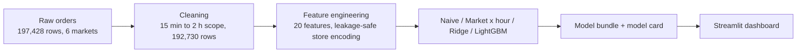

# DeliveryOps — Real-Time Delivery ETA Prediction & Promise Windows

[](https://foodops-delivery.streamlit.app/)
[](https://www.python.org/)
[](https://lightgbm.readthedocs.io/)
[](#6-models--benchmark-scoreboard)
[](#6-models--benchmark-scoreboard)
[](https://foodops-delivery.streamlit.app/)

**DeliveryOps** is the delivery-time module of **FoodOps.AI**. It predicts how long each order will take, from the moment it is placed to the customer's door, and returns an expected time (P50) together with an optimistic bound (P10) and a conservative bound (P90). It is trained on **192,730 cleaned deliveries across 6 markets and 6,725 stores** and serves the estimates through an interactive dashboard.

It is built for dispatch and customer-experience teams who need to decide **what delivery time to show a customer**: promise too little and orders arrive late, promise too much and customers abandon the cart.

> 🚀 **Live Application:** [https://foodops-delivery.streamlit.app/](https://foodops-delivery.streamlit.app/)

### At a Glance

| | |
| :--- | :--- |
| **Task** | Order-level delivery-time estimate with a P10 / P50 / P90 window |
| **Data** | 192,730 cleaned orders (197,428 raw), 6 markets, Jan 21 to Feb 17, 2015 |
| **Deployed models** | LightGBM: L1 objective for P50, quantile objective for P10 and P90, 20 features, raw-seconds target |
| **Test MAE** | **9.97 min** (naive median baseline: 13.05 min, a **23.6% reduction**) |
| **Interval coverage** | P90 **88.2%** (nominal 90%), 80% interval **79.1%** (nominal 80%). Raw, not calibrated. |
| **Models compared** | Naive median → Market × hour median → Ridge → LightGBM |
| **Dashboard** | ETA simulator with a P10–P90 window and a "why this ETA" explanation, model benchmarks, network analytics |

---

## Table of Contents

1. [Executive Summary & Operational Context](#1-executive-summary--operational-context)
2. [Problem Formulation & Metrics](#2-problem-formulation--metrics)
3. [Dataset & Validation Strategy](#3-dataset--validation-strategy)
4. [Exploratory Findings](#4-exploratory-findings)
5. [Feature Engineering Pipeline](#5-feature-engineering-pipeline)
6. [Models & Benchmark Scoreboard](#6-models--benchmark-scoreboard)
7. [Evaluation Notes & Limitations](#7-evaluation-notes--limitations)
8. [Interactive Streamlit Dashboard](#8-interactive-streamlit-dashboard)
9. [Repository & Module Layout](#9-repository--module-layout)
10. [Local Quickstart](#10-local-quickstart)
11. [Insights & Business Takeaways](#11-insights--business-takeaways)

---

## 1. Executive Summary & Operational Context

In on-demand food delivery, the delivery time shown at checkout shapes both customer trust and unit economics:

- **The cost of under-estimating:** late deliveries, bad reviews and refund requests.
- **The cost of over-estimating:** customers see a slow ETA and switch to a competing app before ordering.

DeliveryOps turns the order, the store, the market and the live dispatch load into a delivery-time estimate with an uncertainty window. It benchmarks four modeling paradigms of increasing complexity (a global median, a market-by-hour lookup, a regularized linear model and gradient-boosted trees), selects the champion on forward-in-time validation, scores it once on a held-out week, and packages it into a dashboard where an operator can enter an order and see the expected time, the promise window and the factors behind them.


```mermaid
flowchart LR
    A["Raw orders<br/>197,428 rows, 6 markets"] --> B["Cleaning<br/>15 min to 2 h scope, 192,730 rows"]
    B --> C["Feature engineering<br/>20 features, leakage-safe store encoding"]
    C --> D["Naive / Market x hour / Ridge / LightGBM"]
    D --> E["Model bundle + model card"]
    E --> F["Streamlit dashboard"]
```

---

## 2. Problem Formulation & Metrics

- **Target:** total delivery duration $y_i$ in seconds for order $i$, defined as `actual_delivery_time − created_at`.
- **Scope:** deliveries of **15 minutes to 2 hours**. Faster orders are implausible and slower ones are out of scope for an ETA promise. Every metric in this document applies to that scope only.
- **Training scale:** raw seconds for LightGBM. A log transform was compared on the validation folds and tied, so the simpler scale that matches the reporting metric was kept. The Ridge baseline trains on a log target, which it preferred.
- **Output:** three estimates per order, the P10, P50 and P90 of the delivery-time distribution. The P50 is the expected time and the P10–P90 range is the promise window.
- **Training objectives:** the P50 model minimizes absolute error (L1, the conditional median). The P10 and P90 models minimize the pinball loss for quantile $\tau$:

  $$L_\tau(y, \hat{q}) = \max\big(\tau\,(y - \hat{q}),\ (\tau - 1)\,(y - \hat{q})\big)$$

  Predictions for each order are sorted so that $\text{P10} \le \text{P50} \le \text{P90}$.

### Metrics

$$\text{MAE} = \frac{1}{N}\sum_i |y_i - \hat{y}_i| \qquad \text{Bias} = \frac{1}{N}\sum_i (\hat{y}_i - y_i) \qquad \text{Coverage}_\tau = \frac{1}{N}\sum_i \mathbb{1}\left[y_i \le \hat{q}_{\tau,i}\right]$$

| Metric | Why it is reported |
| :--- | :--- |
| **MAE** (primary KPI, minutes) | The average absolute miss of the P50 estimate, in units an operator can read. |
| **Bias** (minutes) | Mean prediction minus actual. Negative means the model under-estimates on average (late-delivery risk). MAE alone cannot show this direction. |
| **P10 / P90 coverage** | The share of orders that finish at or below the P10 and P90 estimates. A well-behaved model lands near 10% and 90%. |
| **80% interval coverage** | The share of orders inside the P10–P90 window. The nominal target is 80%. |
| **Mean interval width** (minutes) | Coverage can be bought with a very wide window, so width is reported alongside it. |
| **Pinball loss** | The training loss of the quantile models, used to compare quantile fits across rounds. |

---

## 3. Dataset & Validation Strategy

- **Source:** [DoorDash ETA Prediction (Kaggle)](https://www.kaggle.com/datasets/dharun4772/doordash-eta-prediction)

`historical_data.csv` holds 197,428 orders (no duplicate rows) and 16 columns, covering 2015-01-21 07:22 to 2015-02-17 22:00 local time:

| Group | Columns |
| :--- | :--- |
| **Order & cart** | `subtotal`, `total_items`, `num_distinct_items`, `min_item_price`, `max_item_price`, `order_protocol` |
| **Store & market** | `store_id`, `store_primary_category`, `market_id` |
| **Dispatch load** | `total_onshift_dashers`, `total_busy_dashers`, `total_outstanding_orders` |
| **Platform estimates** | `estimated_order_place_duration`, `estimated_store_to_consumer_driving_duration` |
| **Timestamps** | `created_at`, `actual_delivery_time` (both naive UTC) |

The dataset has no weather, traffic or GPS information. Routing enters only through the platform's own drive-time estimate.

### Cleaning

Timestamps are converted from UTC to US/Pacific, where all six markets peak at the same local hours. Cleaning removes **4,698 rows (2.38% of raw)**, each step logged in `cleaning_log_final.csv`:

| Step | Rows removed | % of raw | Reason |
| :--- | ---: | ---: | :--- |
| No delivery time | 7 | <0.01% | Order never completed, so there is no label |
| Longer than 2 h | 1,090 | 0.55% | Out of scope for ETA promises |
| Shorter than 15 min | 328 | 0.17% | Implausibly fast, includes clock errors |
| `market_id` missing | 974 | 0.49% | Under 1% missing, dropped |
| `order_protocol` missing | 505 | 0.26% | Under 1% missing, dropped |
| Drive estimate missing | 522 | 0.26% | Under 1% missing, dropped |
| Negative dasher or order counts | 80 | 0.04% | A count cannot be negative |
| `min_item_price` > `max_item_price` | 775 | 0.39% | Logically impossible price pair |
| `subtotal` ≤ 0 | 176 | 0.09% | Zero or negative order value |
| Drive estimate = 0 | 8 | <0.01% | A zero-second drive is not plausible |
| `total_items` above the 99.9th percentile (25) | 168 | 0.09% | Extreme order size |
| Order hour 6 or 23 | 46 | 0.02% | Only 35 and 11 orders, too few to learn a pattern |
| `order_protocol` 7 | 19 | 0.01% | Only 19 orders, none in the test week |
| **Rows kept** | **192,730** | | |

Two kinds of missing values are deliberately **not** removed. The three dasher-load columns go missing together in 15,900 rows (8.25%), almost entirely in Market 6, and are kept as missing with an explicit flag. A missing `store_primary_category` (about 1.5% of orders) is filled from the store's category when the store has exactly one known category, and otherwise set to `unknown`, with a flag.

### Time-Based Validation Split

Random $k$-fold validation would let the model see later days while predicting earlier ones. DeliveryOps uses a strict chronological hold-out:

```
[=================== TRAIN: Jan 21 to Feb 10 (21 days) ===================][== TEST: Feb 11 to Feb 17 (7 days) ==]
                                                                           ↑
                                                                 Cutoff: 2015-02-11 00:00 Pacific
```

| Partition | Dates | Rows | Share | Role |
| :--- | :--- | ---: | ---: | :--- |
| Train | Jan 21 – Feb 10 | 141,188 | 73.3% | Model fitting and all design decisions |
| Test | Feb 11 – Feb 17 | 51,542 | 26.7% | Scored once, after every choice was frozen |

The test week includes Valentine's Day weekend and runs slower than the training period (median 45.3 min against 43.9), so it also stress-tests the model against drift.

### Validation inside the training period

All model choices (hour form, features, boosting rounds) were made on two forward folds inside the training period, so the test week was never used for selection:

| Fold | Fit window | Validation window | Fit rows | Validation rows |
| :---: | :--- | :--- | ---: | ---: |
| A | Jan 21 – Jan 27 | Jan 28 – Feb 3 | 44,678 | 45,937 |
| B | Jan 21 – Feb 3 | Feb 4 – Feb 10 | 90,615 | 50,573 |

Each validation window contains every weekday exactly once, like the test week. Fold B (14 days of history, 98.2% of validation orders from already-seen stores) is the closer match to the test setup. Fold A is harsher: it has 7 days of history and its validation week includes Super Bowl Sunday, the slowest day in the data. The store encoding is rebuilt from each fold's fit rows only (see [Section 5.3](#53-leakage-control)).

The final models are refit on all 21 training days with a single fixed seed (42) and scored once on the test week.

---

## 4. Exploratory Findings

Analysis lives in [`notebooks/EDA_final.ipynb`](./notebooks/EDA_final.ipynb).

- **Right-skewed target.** On the uncleaned data, delivery time has a median of 44.3 min but a 95th percentile of 81.2, a 99th of 107.9 and a 99.9th of 165.6. Skew is 1.01 on the raw training target and 0.02 after a log transform. The 15-minute-to-2-hour scope removes the extreme tail.
- **Strong time-of-day pattern.** Orders run from about 07:00 to 23:00 local. 18:00 is both the busiest hour (18.7% of training rows) and the slowest (median 50.7 min). 21:00 and 10:00 are the fastest hours (36.6 and 37.6 min).
- **Dispatch load.** When no dashers are on shift, the median delivery takes 49.8 min against 43.8 when someone is (90th percentile 80.3 against 69.1). These orders are 1.97% of rows with telemetry, 96% of them in Markets 1 and 3. Where dashers are on shift, the median order sees 0.96 busy dashers and 1.20 outstanding orders per on-shift dasher.
- **Missing telemetry.** The three dasher columns go missing together in 8.25% of rows. Market 6 is 95.5% missing, Market 3 about 7% and the rest about 0.5%. In about 20% of rows the number of busy dashers exceeds the number on shift. These rows were kept untouched.
- **Stores matter.** There are 6,725 stores, but the median store has only 11 orders and 46.7% have fewer than 10. The 6.3% of stores with 100 or more orders place 42.1% of all orders. In a forward test (fit Jan 21 – Feb 3, score Feb 4 – 10), a smoothed store average alone reached R² 0.113 and cut MAE from 12.47 to 11.96 min. A category average alone reached R² 0.02, and 98.2% of later orders came from stores seen earlier.
- **The order-place estimate is almost a protocol label.** `estimated_order_place_duration` is 251 s in 70.4% of rows and 446 s in 29.5%. Protocols 2, 3 and 5 give 251 s in about 98% of orders, and protocols 1 and 6 give 446 s in 96–97%.
- **Drift inside the data.** The slowest day is Super Bowl Sunday, Feb 1 (median 53.4 min, 90th percentile 92.6). Valentine's Saturday, Feb 14, has a median of 48.2 and a 90th percentile of 76.1, against 43.0–46.1 and 66.7–70.1 on the three earlier Saturdays.
- **Strongest raw correlates with the target** (training rows): `outstanding_order_ratio` 0.349, the store encoding 0.321, the drive estimate 0.244 and `subtotal` 0.224. These are raw correlations, not controlled effects.

---

## 5. Feature Engineering Pipeline

Implemented in [`notebooks/feature_engineering.ipynb`](./notebooks/feature_engineering.ipynb). The notebook builds 32 candidate features; the final model keeps **20** after the ablation in [Section 6](#6-models--benchmark-scoreboard).

### 5.1 Time and scope

Local hour (7–22) and weekday (0 = Monday) are derived from the US/Pacific timestamp. The 46 orders placed in hours 6 and 23 and the 19 orders on protocol 7 are dropped, since there are too few of them to learn a pattern. The split into train and test happens at local midnight on 2015-02-11.

### 5.2 Features (20 in the final model)

| Group | Features | Definition |
| :--- | :--- | :--- |
| **Order size & value** | `total_items`, `subtotal`, `num_distinct_items`, `min_item_price`, `max_item_price` | Raw cart attributes (prices in cents) |
| **Routing & kitchen** | `estimated_store_to_consumer_driving_duration`, `estimated_order_place_duration` | Platform drive-time estimate, and the platform's order-placement estimate (251 s or 446 s) |
| **Dispatch load** | `total_onshift_dashers`, `total_busy_dashers`, `total_outstanding_orders` | Live market telemetry, missing when unavailable |
| **Load ratios** | `busy_dasher_ratio`, `outstanding_order_ratio` | Busy dashers and outstanding orders per on-shift dasher, uncapped. Missing when no one is on shift or telemetry is missing. |
| **Time** | `order_hour`, `order_day_of_week` | Local hour and weekday as integers |
| **Store** | `store_target_enc`, `store_primary_category`, `store_category_imputed` | Smoothed store average delivery time, the store's category (74 named levels plus `unknown`), and a flag for a filled-in category |
| **Market & channel** | `market_id`, `order_protocol` | 6 markets and 6 order protocols, handled as native categoricals |
| **Telemetry flag** | `dasher_telemetry_missing` | 1 when the three dasher columns are missing |

**Store target encoding.** For store $s$ with $n_s$ training orders and mean delivery time $\bar{y}_s$ (in seconds), the encoding is shrunk toward the overall training mean $\bar{y}$:

$$\text{enc}_s = \frac{n_s\,\bar{y}_s + m\,\bar{y}}{n_s + m}, \qquad m = 5$$

A store with no training history receives $\bar{y}$. Smoothing weight 5 beat weight 20 for every key tested.

**Missing values.** LightGBM handles the dasher columns and the two load ratios natively, so they are never imputed. Only the Ridge baseline imputes them, inside its own pipeline.

**Candidates tested and not kept.** Hour as a sine/cosine pair or as meal-period buckets, weekday as one-hot dummies, the busy ratio capped at 1, and a `zero_onshift` flag. See the ablation in [Section 6](#6-models--benchmark-scoreboard).

### 5.3 Leakage control

- **Leave-one-day-out store encoding.** For training rows, a row's own day is excluded from both the store sums and the overall mean, so an order never helps encode itself. Test rows and serving use the full-training lookup. Stores unseen in training (281 test stores, 1.5% of test orders) receive the training mean.
- **Per-fold re-encoding.** Inside each validation fold the encoding is recomputed from that fold's fit rows only. Using the stored column instead would have made validation look 0.04 min better on average (Fold A 0.067, Fold B 0.014).
- **Pipeline statistics.** Imputation, scaling and one-hot levels in the Ridge pipeline are fit on fit rows only.
- **Test week untouched.** Every decision was fixed before the single test evaluation.

---

## 6. Models & Benchmark Scoreboard

All models are scored on the same rows: the two validation folds, and the held-out test week (51,542 orders). Bias is mean prediction minus actual, in minutes.

| Rank | Model | Family | Test MAE (min) | Test bias (min) | Validation MAE (A / B) | Role |
| :---: | :--- | :--- | :---: | :---: | :---: | :--- |
| 🥇 | **LightGBM** (P50, L1 objective) | Gradient Boosted Trees | **9.97** | −3.11 | 11.19 / 9.88 | **Champion (deployed)** |
| 🥈 | **Ridge Regression** | L2-Regularized Linear Model | 10.28 | −2.63 | 11.37 / 10.13 | Linear baseline |
| 🥉 | **Market × hour median** | Heuristic lookup | 12.26 | −4.06 | 13.41 / 11.82 | Lookup baseline |
| 4 | **Naive median** | Heuristic | 13.05 | −4.25 | 14.05 / 12.47 | Lower bound |

### Prediction intervals (LightGBM P10 / P50 / P90)

| Metric | Nominal | Fold A | Fold B | Test week |
| :--- | :---: | :---: | :---: | :---: |
| P10 coverage | 10% | 11.2% | 12.7% | **9.1%** |
| P90 coverage | 90% | 84.8% | 90.2% | **88.2%** |
| 80% interval coverage | 80% | 73.6% | 77.5% | **79.1%** |
| Mean P10–P90 width (min) | n/a | 29.4 | 30.6 | **30.6** |
| Pinball loss P10 | n/a | 1.973 | 1.754 | 1.787 |
| Pinball loss P90 | n/a | 3.314 | 2.817 | 2.812 |

Fold values are averages over three seeds, and the test week uses the final seed-42 models. Intervals are **raw**: no calibration step was applied, so these are the coverages the models actually deliver.

### Model details

- **Naive median.** Predicts the training median (43.9 min) for every order.
- **Market × hour median.** The median delivery time in each (market, order hour) cell of the training rows, with the global median for an empty cell. Thin cells (under 30 training orders) hold at most 0.25% of validation rows.
- **Ridge Regression.** scikit-learn pipeline fit on a log(1 + seconds) target. The order and price columns, the dasher counts and the two ratios are log-transformed (negatives clipped at 0), median-imputed and standardized. The two platform estimates and the store encoding are standardized. Weekday dummies and binary flags pass through, and market, protocol, order hour and store category are one-hot encoded (store categories with fewer than 100 fit rows are pooled into `other`). Hour form, target scale and regularization were picked from a grid of 3 hour forms × 2 target scales × 6 alphas on the two folds: one-hot hour with the log target and $\alpha = 1000$ won. One-hot hour beat meal-period buckets and sine/cosine by roughly 0.1 to 0.2 min in both folds and for both targets.
- **LightGBM.** Native categorical and missing-value handling, raw-seconds target, seed 42. No hyperparameter search was run: the reference configuration is on the plateau of its validation curves, so the effort went into feature and round-count decisions that could be judged against a noise floor.

  | Setting | P50 | P10 | P90 |
  | :--- | :---: | :---: | :---: |
  | Objective | L1 | Quantile (τ = 0.1) | Quantile (τ = 0.9) |
  | Boosting rounds | 300 | 200 | 100 |
  | Learning rate | 0.05 | 0.05 | 0.05 |
  | Leaves / min child samples | 31 / 100 | 31 / 100 | 31 / 100 |
  | Row subsample / column subsample | 0.8 / 0.8 | 0.8 / 0.8 | 0.8 / 0.8 |

  Rounds come from validation curves with no early stopping. For P50, MAE flattens by about 250 rounds, so 300 was fixed. For the quantiles, the rule was the smallest round whose pinball loss is within the seed spread of the minimum in both folds. More rounds pull the tails inward (P10 coverage drifts above 10% and P90 below 90%), which is why the quantile models stop early.

### Feature ablation (LightGBM, validation)

Each row changes one thing from the 21-feature reference (all other features unchanged, 300 rounds, three seeds). The reference's seed-to-seed spread, the noise floor, is 0.026 min in Fold A and 0.018 min in Fold B. A change was adopted only if it beat that floor in both folds and was better on at least 10 of the 14 validation days. On a tie, the smaller feature set wins.

| Change from the reference | ΔMAE Fold A | ΔMAE Fold B | Days better (of 14) | Outcome |
| :--- | ---: | ---: | :---: | :--- |
| Drop `zero_onshift` | −0.008 | +0.006 | 6 | **Adopted** (tie, smaller set) |
| Capped busy ratio instead of uncapped | +0.002 | −0.016 | 6 | Kept reference (tie) |
| Hour as sine/cosine | +0.010 | +0.006 | 6 | Kept reference (tie) |
| Weekday as one-hot dummies | +0.046 | −0.032 | 7 | Kept integer weekday: folds disagree, and Fold A's loss is concentrated on Super Bowl Sunday |
| Drop `estimated_order_place_duration` | +0.021 | +0.025 | 4 | Kept: a small, consistent loss |
| Drop `store_primary_category` | +0.041 | +0.054 | 0 | Kept: dropping it hurts |
| Hour as meal-period buckets | +0.094 | +0.108 | 1 | Kept integer hour: coarser buckets hurt |
| Drop `store_target_enc` | +0.183 | +0.250 | 1 | Kept: the largest single loss |

Positive Δ means worse than the reference. The two rows the rule did not cover (the order-place estimate and the weekday form) were decided by hand and kept at the reference. The result is the 20-feature set in [Section 5.2](#52-features-20-in-the-final-model).

### Performance analysis

- **Each rung helps.** The market × hour lookup cuts MAE by 0.79 min against the naive median, Ridge by a further 1.98 min, and LightGBM by a further 0.30 min: **3.08 min in total, a 23.6% reduction**. On the validation folds the reduction was about 20%.
- **Features did most of the work.** Ridge delivers 2.78 of the 3.08 minutes (90%). LightGBM's extra 0.30 min (2.9% of Ridge's error) is real but modest.
- **The edge is broad.** LightGBM beats Ridge on all 7 test days, in all 6 markets, in all 16 hours and in all 3 store-history bands. It ties in the zero on-shift segment (15.01 against 15.04 min) and wins by 0.2–0.4 min in most others.
- **Sign of the bias.** Every model under-estimates on average. The test week ran slower than the training period (median 45.3 against 43.9 min), and a median-targeted model also sits below the mean of a right-skewed target.

### What drives the predictions (SHAP, P50 model)

Mean absolute SHAP value in minutes over 5,000 random test orders:

| Rank | Feature | Mean \|SHAP\| (min) |
| :---: | :--- | ---: |
| 1 | `outstanding_order_ratio` | 3.90 |
| 2 | `estimated_store_to_consumer_driving_duration` | 3.26 |
| 3 | `store_target_enc` | 3.09 |
| 4 | `order_hour` | 2.34 |
| 5 | `subtotal` | 1.40 |
| 6 | `order_day_of_week` | 0.77 |
| 7 | `market_id` | 0.66 |
| 8 | `store_primary_category` | 0.64 |
| 9 | `order_protocol` | 0.61 |
| 10 | `total_busy_dashers` | 0.59 |

- **Dispatch load is the largest family.** The five load features together sum to about 5.7 min, led by `outstanding_order_ratio`. Higher values push predictions up, with a long tail of roughly +25 min.
- **Drive time and store identity come next.** Longer drive estimates raise the prediction. Slow stores add up to roughly +27 min through the store encoding and fast stores subtract a few minutes.
- **Time and order size.** Hour and weekday together sum to about 3.1 min and act in both directions, consistent with the 18:00 peak and fast 21:00 seen in the EDA. Order size and value sum to about 2.1 min, with larger carts taking longer.
- **Two features contribute nothing.** `store_category_imputed` and `dasher_telemetry_missing` both have a mean |SHAP| of 0.000, since the missing pattern of the dasher columns already carries that signal.
- **A local example shows a limit.** A sampled zero on-shift order took 117.5 min and the P50 model predicted 43.4. Zero on-shift added only about 1.6 min, and nothing else recorded about the order (a small, cheap order from a fast store) signals a near two-hour delay. It is one order, not a pattern.

SHAP describes what the model learned from one observed month. It is association, not cause.

---

## 7. Evaluation Notes & Limitations

- **One test week.** The test week was scored once, after all choices were frozen. Daily MAE across it ranges from 9.04 to 10.76 min, wider than LightGBM's 0.30-min edge over Ridge, but LightGBM was ahead on every day.
- **Level shift and negative bias.** The test week ran slower than the training period, so every model under-estimates (LightGBM bias −3.11 min). 
- **Raw intervals.** P90 coverage is 88.2% against a nominal 90%, and the 80% interval covers 79.1%. The window averages 30.6 min wide, so a narrow promise such as "35 to 50 minutes" is not supported by this model's measured uncertainty. Coverage is lower in the hardest cases (see the table below) and higher where the model is less certain.
- **Validation numbers are mildly flattered.** Ridge settings were chosen from 36 configurations on the same two folds it is scored on, and LightGBM's features and rounds were also chosen there. The test column is not affected.
- **Two folds, 14 days.** Ablation decisions rest on 14 validation days and a noise floor that is the range of only three runs. Two cases fell outside the pre-set rule and were decided by hand.
- **Zero on-shift orders.** When no dasher is on shift, the model cannot anticipate the slowdown even with raw dasher counts (MAE 15.0 min, bias −7.0). The `zero_onshift` flag was dropped by the ablation and was deliberately not revisited after the test week.
- **Thin store history.** The store encoding rests on three weeks of history. Stores with no training orders fall back to the overall mean and are estimated worse (MAE 11.97 against 9.54 for established stores).
- **Weekday evidence is thin.** Each weekday has only three training dates, and Feb 1 (Super Bowl Sunday) is one of the three Sundays.
- **Narrow data.** One early-2015 snapshot with no weather, traffic, GPS or kitchen data, and routing only through the platform's drive-time estimate.

### Test-week segments

| Segment | Orders | Share | LightGBM MAE | Ridge MAE | Bias | P90 coverage |
| :--- | ---: | ---: | ---: | ---: | ---: | ---: |
| Market 1 | 9,594 | 18.6% | 12.02 | 12.44 | −5.29 | 86.2% |
| Market 2 | 14,230 | 27.6% | 9.07 | 9.28 | −2.71 | 87.9% |
| Market 3 | 5,977 | 11.6% | 11.18 | 11.63 | −4.02 | 87.0% |
| Market 4 | 12,203 | 23.7% | 9.23 | 9.45 | −2.21 | 88.9% |
| Market 5 | 5,208 | 10.1% | 9.10 | 9.49 | −2.14 | 89.1% |
| Market 6 | 4,330 | 8.4% | 9.89 | 10.14 | −2.01 | 92.2% |
| Telemetry present | 45,810 | 88.9% | 9.86 | 10.18 | −3.14 | 87.8% |
| Telemetry missing | 4,818 | 9.4% | 10.09 | 10.31 | −2.01 | 92.3% |
| Zero on-shift | 914 | 1.8% | 15.01 | 15.04 | −7.00 | 84.0% |
| Established stores (25+ training orders) | 36,716 | 71.2% | 9.54 | 9.82 | −2.84 | 88.5% |
| Thin stores (1–24) | 14,058 | 27.3% | 10.99 | 11.34 | −3.69 | 87.5% |
| Unseen stores | 768 | 1.5% | 11.97 | 12.41 | −5.41 | 85.0% |

By time, the 18:00 hour (18.7% of orders) has bias −3.73 and P90 coverage 86.1%, and Saturday Feb 14 is the worst day (MAE 10.76, bias −4.43, P90 coverage 85.6%). Thursday Feb 12 is the best (MAE 9.04). Intervals are widest where the model has less information: telemetry-missing orders average a 35.6-min window against 29.9 for orders with telemetry.

---

## 8. Interactive Streamlit Dashboard

> 🌐 **Live Cloud Deployment:** [https://foodops-delivery.streamlit.app/](https://foodops-delivery.streamlit.app/)

Implemented in [`app/streamlit_app.py`](./app/streamlit_app.py) with a theme that adapts to light and dark mode.

### Tab 1: ETA Simulator

1. **Order inputs.** Market, store, order hour and weekday, cart size and value, protocol and the platform's drive-time estimate. The panel shows the selected store's training history and flags stores the model has never seen.
2. **Dispatch load.** On-shift dashers, busy dashers and outstanding orders, or a switch to mark telemetry as unavailable, which mirrors how the model was trained.
3. **Delivery window.** The expected time (P50) with the P10–P90 window, the window width, and the model's average under-estimation for context.
4. **What-if charts.** The same order across every hour of the day, and across rising dispatch load.
5. **Why this ETA.** A SHAP breakdown of the entered order in minutes, showing which inputs push the estimate up or down.

### How the ETA is produced

The dashboard rebuilds the 20 model features from the raw inputs with the same definitions used in training: local hour and weekday, the two load ratios (missing when no dasher is on shift), the store encoding from the table saved in the model bundle (a new store receives the training mean) and the saved category levels. The three quantile models then predict, and each order's estimates are sorted so that P10 ≤ P50 ≤ P90.

At start-up the app rebuilds the features for a sample of orders from the saved feature table, compares them with the stored values, and **refuses to run if they differ**, so training and serving cannot drift apart silently.

### Tab 2: Model Benchmarks & Evaluation

The scoreboard, interval coverage against nominal, the feature ablation, test-week segments and the documented limitations, all read from `models/delivery_model_card.json`, plus the top LightGBM features by gain share.

### Tab 3: Network & Delivery Analytics

Delivery time by hour, weekday and market, how dispatch load relates to delivery time, and telemetry coverage by market.

---

## 9. Repository & Module Layout

```text
DeliveryOps/
├── README.md                          ← Module documentation (this file)
├── app/
│   ├── streamlit_app.py               ← Dashboard: ETA simulator, benchmarks, analytics
│   └── theme.py                       ← Light/dark theme tokens and chart styling
├── dataset/
│   ├── raw/
│   │   └── historical_data.csv        ← Source DoorDash ETA dataset (197,428 rows)
│   └── processed/
│       ├── cleaned_data.parquet       ← Cleaned orders (27 columns)
│       ├── cleaning_log.csv           ← Rows removed per cleaning step
│       ├── column_roles.json          ← Column roles for the cleaned table
│       ├── processed_data.parquet     ← Feature table (192,730 rows, 40 columns)
│       ├── cleaning_log_final.csv     ← Cleaning log including the feature-engineering drops
│       ├── feature_roles.json         ← Feature roles, categorical levels, ablation groups, serving notes
│       └── store_target_encoding.joblib ← Per-store encoding table from the training period
├── models/
│   ├── delivery_model_bundle.joblib   ← Deployed P10/P50/P90 models, feature contract, store table
│   └── delivery_model_card.json       ← Validation and test results, segments, limitations
├── notebooks/
│   ├── EDA_final.ipynb                ← Profiling, missingness, time and store analysis, cleaning rules
│   ├── feature_engineering.ipynb      ← Time features, load ratios, leakage-safe store encoding
│   └── model_training.ipynb           ← Baselines, Ridge, LightGBM, ablation, quantiles, SHAP, export
└── src/
    ├── data_loader.py                 ← Model card, feature table and analytics loaders
    └── inference.py                   ← Feature rebuilding, P10/P50/P90 prediction, parity check
```

The dashboard reads `delivery_model_bundle.joblib`, `delivery_model_card.json` and the processed feature table. The bundle is self-contained: it carries the three models, the exact feature order, the categorical levels, the store encoding table and the serving notes.

---

## 10. Local Quickstart

### Prerequisites

- Python 3.12
- A virtual environment (`venv` or `conda`)

### Step 1: Clone and create an environment

```bash
git clone https://github.com/iamnitishsah/FoodOps.AI.git
cd FoodOps.AI

python3.12 -m venv .venv
source .venv/bin/activate    # On Windows: .venv\Scripts\activate
```

### Step 2: Install dependencies

```bash
pip install --upgrade pip
pip install -r requirements.txt
```

### Step 3: Launch the dashboard

```bash
streamlit run DeliveryOps/app/streamlit_app.py
```

The app opens at `http://localhost:8501`.

### Reproducing the analysis

Place `historical_data.csv` in `DeliveryOps/dataset/raw/` and run the notebooks in order: `EDA_final.ipynb` → `feature_engineering.ipynb` → `model_training.ipynb`. The training notebook reads `processed_data.parquet` and `feature_roles.json`, and writes the model bundle and the model card to `DeliveryOps/models/`.

---

## 11. Insights & Business Takeaways

1. **Dispatch pressure matters more than distance.** `outstanding_order_ratio` is the strongest driver of the estimate (mean |SHAP| 3.90 min), ahead of the drive-time estimate (3.26) and store identity (3.09). How loaded the market is relative to the dashers on shift moves delivery time more than how far the order travels.
2. **Store identity is a real signal.** Dropping the store encoding costs 0.22 min, the largest loss in the ablation, and slow stores add up to roughly 27 minutes to a prediction. New stores are the weak spot: orders from stores without history are estimated with 11.97 min of error against 9.54 for established ones.
3. **Show a window, not a point.** The 80% window averages 30.6 min wide, so a single number hides a lot of uncertainty. Presenting the P10–P90 range, and not promising a narrower one than the model supports, is the honest customer message.
4. **Peaks and holidays run slower than the model expects.** The 18:00 rush has a bias of −3.7 min and Valentine's Saturday −4.4 min, with P90 coverage near 86% in both. Those periods call for a deliberate buffer on top of the promised time.
5. **The model widens its window when it flies blind.** Orders without dispatch telemetry get a wider P10–P90 window (35.6 min against 29.9) and 92.3% P90 coverage, at almost no cost to point accuracy (MAE 10.09 against 9.86).
6. **No one is on shift is the blind spot.** These orders (1.8% of the test week) average 15.0 min of error with a −7.0 min bias, and neither LightGBM nor Ridge anticipates them. It is the clearest place for future data, such as courier availability signals, to help.
7. **Good features beat a complex model.** A regularized linear model captures 90% of LightGBM's improvement over the naive baseline. The remaining 0.30 min is worth having, but the work that mattered was the dispatch ratios, the leakage-safe store encoding and the hour-of-day shape.