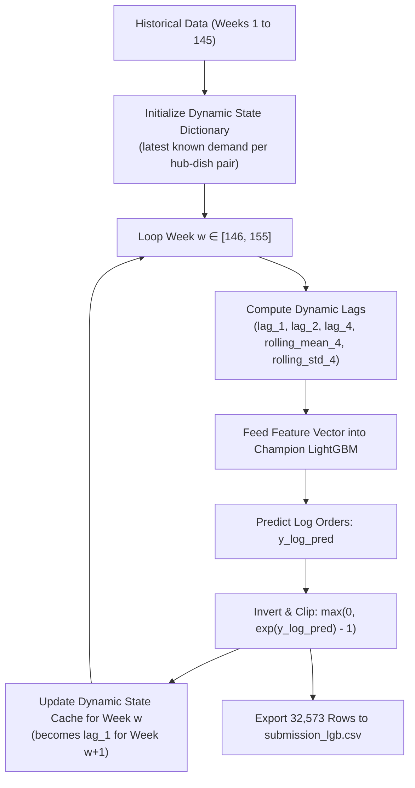

# DemandOps — Decentralized Fulfillment Demand Forecasting

[](https://foodops-ai-demandops.streamlit.app/)
[](https://www.python.org/)
[](https://lightgbm.readthedocs.io/)
[](https://pytorch.org/)
[](#2-model-architecture--benchmark-scoreboard)
[](https://foodops-ai-demandops.streamlit.app/)

**DemandOps** is the predictive demand intelligence module of **FoodOps.AI**. It provides granular, multi-step weekly order forecasts across a decentralized fulfillment center network (77 fulfillment hubs, 51 menu dishes, 14 categories, and 4 cuisines).

Designed for cloud kitchen managers, supply chain planners, and operations executives, DemandOps eliminates food spoilage from over-preparation while preventing kitchen stockouts and fulfillment bottlenecks.

> 🚀 **Live Production Application:** [https://foodops-ai-demandops.streamlit.app/](https://foodops-ai-demandops.streamlit.app/)

---

## Table of Contents

1. [Executive Summary & Operational Context](#1-executive-summary--operational-context)
2. [Problem Formulation & Mathematical Framing](#2-problem-formulation--mathematical-framing)
3. [Dataset Architecture & Validation Strategy](#3-dataset-architecture--validation-strategy)
4. [Feature Engineering Pipeline](#4-feature-engineering-pipeline)
5. [Model Architecture & Benchmark Scoreboard](#5-model-architecture--benchmark-scoreboard)
6. [Why WAPE Over RMSE & MAPE in Food Supply Chains](#6-why-wape-over-rmse--mape-in-food-supply-chains)
7. [Autoregressive Multi-Step Roll-Forward Engine](#7-autoregressive-multi-step-roll-forward-engine)
8. [Interactive Streamlit Operations Dashboard](#8-interactive-streamlit-operations-dashboard)
9. [Repository & Module Directory Layout](#9-repository--module-directory-layout)
10. [Local Quickstart & Execution Guide](#10-local-quickstart--execution-guide)
11. [Supply Chain Insights & Business Takeaways](#11-supply-chain-insights--business-takeaways)

---

## 1. Executive Summary & Operational Context

In high-velocity food delivery networks and on-demand cloud kitchens, demand forecasting sits at the core of profitability and customer experience:

- **The Cost of Over-Predicting:** Perishable ingredient spoilage, wasted prep labor, cold-storage overload, and direct operating loss.
- **The Cost of Under-Predicting:** Kitchen stockouts, canceled orders, delayed rider dispatches, elevated delivery wait times, and brand attrition.

DemandOps solves this operational challenge by transforming raw transactional logs across 145 operating weeks into calibrated forward forecasts. The module benchmarks multiple modeling paradigms (heuristics, regularized linear models, sequential deep learning, and gradient-boosted decision trees) to select the champion model and packages it into an interactive operations console with scenario simulation capabilities.

---

## 2. Problem Formulation & Mathematical Framing

- **Target Prediction:** Weekly demand volume ($\mathrm{num\_orders}_{c, m, t}$) for every unique fulfillment center $c \in \{1, \dots, 77\}$ and catalog dish $m \in \{1, \dots, 51\}$ for forward operational weeks $t$.
- **Forecast Horizon:** 10 weeks forward out-of-sample (Weeks 146 to 155).
- **Target Transformation:** Food order distributions exhibit heavy right-skew, high-volume seasonal spikes, and long tails. To stabilize error variance across both niche and staple dishes, training targets are transformed via natural log:
  
  $$y_{\log} = \log(1 + \mathrm{num\_orders})$$

- **Inversion & Operational Guardrail:** Out-of-sample inferences are mapped back to actual order volumes and clipped to zero to guarantee non-negative operational quantities:

  $$\widehat{\mathrm{num\_orders}} = \max\left(0, \exp(\hat{y}_{\log}) - 1\right)$$

- **Safety Stock Recommendation:** The production engine calculates an automated +15% prep inventory buffer ($\lceil 1.15 \times \widehat{\mathrm{num\_orders}} \rceil$) and an 80% empirical confidence range to protect kitchen operations against unexpected peak surges.

---

## 3. Dataset Architecture & Validation Strategy

The module leverages transactional fulfillment records covering **119.5 million historical meal orders** across 77 fulfillment hubs:

| Dataset File | Granularity | Scope / Dimensions | Key Attributes |
| :--- | :--- | :--- | :--- |
| [`data/raw/train.csv`](./data/raw/) | `(center_id, meal_id, week)` | 456,548 records (Weeks 1–145) | `id`, `week`, `center_id`, `meal_id`, `checkout_price`, `base_price`, `emailer_for_promotion`, `homepage_featured`, `num_orders` |
| [`data/raw/fulfilment_center_info.csv`](./data/raw/) | Center Entity | 77 fulfillment hubs | `center_id`, `city_code`, `region_code`, `center_type` (TYPE_A, TYPE_B, TYPE_C), `op_area` (sq km) |
| [`data/raw/meal_info.csv`](./data/raw/) | Meal Entity | 51 unique dishes | `meal_id`, `category` (14 distinct categories), `cuisine` (Continental, Indian, Italian, Thai) |
| [`data/raw/test.csv`](./data/raw/) | `(center_id, meal_id, week)` | 32,573 records (Weeks 146–155) | Unseen operational evaluation set for forward roll-out |

### Leakage-Free Temporal Validation Split

Standard random cross-validation ($k$-fold) randomly samples rows from the future to predict the past, causing catastrophic lookahead leakage. DemandOps enforces a strict **temporal hold-out boundary**:

```
[===================== TRAINING SET: Weeks 1 to 131 =====================] [== VALIDATION: Weeks 132 to 145 ==] [== TEST: Weeks 146 to 155 ==]
                                                                          ↑
                                                                 Cutoff: Week 131
```

- **Training Partition (Weeks 1–131):** 407,259 records (~90% historical horizon).
- **Validation Partition (Weeks 132–145):** 49,289 records (~10% temporal hold-out, 14 continuous weeks).
- **Test Partition (Weeks 146–155):** 32,573 records (10-week multi-step forward horizon).

---

## 4. Feature Engineering Pipeline

All engineered features are constructed strictly without future leakage in [`notebooks/feature_engineering.ipynb`](./notebooks/feature_engineering.ipynb):

1. **Autoregressive Lags:**
   - `lag_1`: Order volume 1 week prior ($\log(1 + y_{t-1})$).
   - `lag_2`: Order volume 2 weeks prior ($\log(1 + y_{t-2})$).
   - `lag_4`: Order volume 4 weeks prior ($\log(1 + y_{t-4})$).
2. **Rolling Window Volatility & Velocity:**
   - `rolling_mean_4`: 4-week backward rolling mean order volume, capturing short-term demand trajectory.
   - `rolling_std_4`: 4-week backward rolling standard deviation, capturing order volatility and operational unpredictability.
3. **Pricing & Commercial Strategy Signals:**
   - `checkout_price`: Customer checkout price after applying active markups or promotions.
   - `base_price`: Catalog baseline price.
   - `price_change_pct`: Relative promotional discount or price increase:
     $$\text{price\_change\_pct} = \frac{\text{checkout\_price} - \text{base\_price}}{\text{base\_price}}$$
4. **Marketing & Placement Interventions:**
   - `emailer_for_promotion`: Binary indicator (1 if the meal was featured in outbound marketing push).
   - `homepage_featured`: Binary indicator (1 if featured prominently on the delivery app homepage carousel).
5. **Seasonality & Calendar Cycles:**
   - `week_of_year`: Calendar week index ($1 \dots 52$), capturing annual seasonal spikes, holiday cycles, and recurring summer/winter dining habits.
6. **Facility & Catalog Entity Metadata:**
   - `op_area`: Fulfillment center service territory size (in square kilometers).
   - Categoricals: `category`, `cuisine`, `center_type`, `center_id`, `meal_id`.

---

## 5. Model Architecture & Benchmark Scoreboard

Four model families spanning heuristics, regularized linear models, sequential deep learning, and gradient boosted trees were systematically trained on weeks 1–131 and evaluated on unseen weeks 132–145:

| Rank | Model Architecture | Model Family | Validation WAPE (%) | Validation MAPE (%) | Status | Key Characteristics |
| :---: | :--- | :--- | :---: | :---: | :---: | :--- |
| 🥇 | **LightGBM Regressor** | Gradient Boosted Decision Trees | **28.75%** | **44.14%** | **Champion (Production Deployed)** | Objective: `regression_l1`, 1,000 estimators, lr=0.05, 63 leaves. Captures sharp non-linear price elasticity and promo cross-features. |
| 🥈 | **Simple LSTM** | Deep Learning (PyTorch) | **29.98%** | **44.02%** | Challenger Model | Single-layer LSTM (32 hidden units) encoding 8-week history vectors fused with target-week planned interventions. |
| 🥉 | **Ridge Regression** | L2-Regularized Linear Model | **35.72%** | **46.98%** | Linear Baseline | Scikit-learn Pipeline with `StandardScaler` on continuous features and `OneHotEncoder` on entity IDs ($\alpha=10$). |
| 4 | **Naive Lag-1 Baseline** | Heuristic Benchmark | **41.96%** | **67.23%** | Lower Bound Benchmark | Replicates prior week demand ($\hat{y}_t = y_{t-1}$). Demonstrates pure temporal persistence. |

### Performance Analysis
- **LightGBM vs. Naive Baseline:** 13.21 percentage point reduction in WAPE (a **31.5% relative error reduction**), drastically cutting inventory waste.
- **LightGBM vs. Simple LSTM:** LightGBM edged out the PyTorch LSTM by 1.23 percentage points on WAPE with instantaneous sub-millisecond CPU inference and native handling of high-cardinality categorical splits.
- **LightGBM Artifact Bundle:** Serialized to [`models/lgb_model_bundle.joblib`](./models/lgb_model_bundle.joblib) containing the trained estimator, exact input feature contract, categorical schema, and validation benchmark metrics.

---

## 6. Why WAPE Over RMSE & MAPE in Food Supply Chains

Standard regression metrics fail when applied to real-world cloud kitchen supply chains:

$$\text{WAPE} = \frac{\sum_{i=1}^N |y_i - \hat{y}_i|}{\sum_{i=1}^N y_i} \times 100 \qquad \text{vs.} \qquad \text{MAPE} = \frac{1}{N} \sum_{i=1}^N \frac{|y_i - \hat{y}_i|}{y_i} \times 100$$

1. **Volume Weighting Reflects Kitchen Reality:** High-volume staples (e.g. Biryanis, Rice Bowls, Beverages) generate 80%+ of gross order volume and ingredient consumption. WAPE weights absolute deviations by true order volume, ensuring a 20-unit error on a 500-order staple does not receive the same penalty as a 20-unit error on an exotic 2-order dish.
2. **Division-by-Zero & Low-Volume Distortion:** Standard MAPE divides each prediction error by individual row demand ($y$). When a regional kitchen sells 1 portion of a niche item, a model prediction of 3 produces a 200% MAPE error, artificially distorting aggregate performance figures.
3. **RMSE Centralization Bias:** RMSE squares prediction errors ($\sum (y - \hat{y})^2$), meaning it is overwhelmingly dominated by the top 5 largest fulfillment hubs, masking systematic stockouts at smaller regional hubs.

---

## 7. Autoregressive Multi-Step Roll-Forward Engine

The raw forward test dataset ([`data/raw/test.csv`](./data/raw/test.csv)) spans **weeks 146 through 155 (10 weeks forward)**. Because future actual orders are unavailable, future lags (`lag_1`, `lag_2`, `lag_4`) and rolling statistics (`rolling_mean_4`, `rolling_std_4`) are unknown for weeks 147 onward.

To simulate real-world weekly operations without lookahead bias, DemandOps implements an **Autoregressive Multi-Step Roll-Forward Inference Engine** in [`notebooks/test_evaluation.ipynb`](./notebooks/test_evaluation.ipynb):



### Roll-Forward Audit Results:
- **Total Test Records Predicted:** 32,573 rows.
- **Data Integrity:** 0 null values, 0 missing rows, 0 negative values.
- **Artifact Exported:** [`data/processed/submission_lgb.csv`](./data/processed/submission_lgb.csv) ready for downstream enterprise resource planning (ERP) systems.

---

## 8. Interactive Streamlit Operations Dashboard

The interactive operations console is implemented in [`app/streamlit_app.py`](./app/streamlit_app.py) and designed according to high-contrast, theme-adaptive enterprise standards.

> 🌐 **Live Cloud Deployment:** [https://foodops-ai-demandops.streamlit.app/](https://foodops-ai-demandops.streamlit.app/)

```
========================================================================================
                          FoodOps.AI — DemandOps Application
========================================================================================
 [Tab 1: Forecast & What-If]   [Tab 2: Model Benchmarks]   [Tab 3: Kitchen Analytics]
----------------------------------------------------------------------------------------
 01 Hub & Dish Selection        04 Forecast & Inventory Buffer
  - Fulfillment Hub: Hub 55       - FORECASTED ORDERS: 1,428 (+12.4% vs prior)
  - Catalog Dish: Meal 1885       - KITCHEN PREP BUFFER: 1,643 (+15% safety stock)
                                  - EST. GROSS REVENUE: $185,640 ($130.00 / unit)
 02 Pricing Strategy              - 80% Expected Demand Range: 1,214 to 1,642 orders
  - Base List Price: $140.00
  - Checkout Price: $130.00     05 Price Elasticity & Revenue Sensitivity
  - Active Discount: -7.1%        - Interactive price sweep (-30% to +30%)
                                  - Current Price vs. Revenue Optimal Price point
 03 Promotions & Timing
  - [x] Email Campaign          06 Promotional Channel Lift
  - [x] Homepage Featured         - Baseline vs Email vs Homepage vs Combined lift
  - Target Week of Year: W25
========================================================================================
```

### Application Features:
1. **Interactive Single-Dish Forecast Engine:**
   - Real-time dropdown selection across 77 fulfillment hubs and 51 catalog dishes.
   - Auto-loads latest historical demand baseline and historical lag context from [`latest_known_state.csv`](./data/processed/latest_known_state.csv).
   - Granular pricing controls with dynamic percentage discount/markup computation.
   - Promotional toggles for Email Campaigns and App Homepage Banners.
   - Automated +15% kitchen preparation buffer and 80% confidence bound.
2. **Price Elasticity & Revenue Sensitivity Curve:**
   - Sweeps checkout prices from $-30\%$ to $+30\%$ around base price.
   - Plots non-linear demand elasticity against expected gross revenue ($P \times Q$).
   - Automatically identifies and annotates the **revenue-maximizing price point**.
3. **Promotional Channel Lift Simulator:**
   - Compares 4 marketing scenarios: No Promotion, Email Only, Homepage Featured Only, and Combined Campaign.
   - Quantifies the marginal demand uplift generated by each acquisition channel.
4. **Model Benchmark Scoreboard & Metrics Comparison:**
   - Side-by-side WAPE and MAPE horizontal comparison charts across all 4 architectures.
   - Top 12 predictive feature importance (gain & splits) extracted directly from LightGBM.
   - Mathematical documentation explaining metric design for supply chain applications.
5. **Portfolio & Kitchen Analytics:**
   - Network KPIs: Active hubs (77), catalog dishes (51), cuisines (4), and meal categories (14).
   - Total historical demand volume breakdown by meal category.
   - Cuisine demand share donut chart (Continental, Indian, Italian, Thai).
   - 145-week platform-wide weekly demand trajectory curve.
6. **Adaptive Light/Dark Theme Support:**
   - Built on [`app/theme.py`](./app/theme.py) ensuring high contrast, clean typography, and responsive Plotly visual designs in both light and dark display modes.

---

## 9. Repository & Module Directory Layout

```
DemandOps/
├── README.md                      ← Comprehensive module documentation (this file)
├── app/
│   ├── __init__.py
│   ├── streamlit_app.py           ← Interactive Streamlit operations dashboard
│   └── theme.py                   ← Theme styling, CSS tokens, and Plotly layout helpers
├── data/
│   ├── raw/                       ← Source datasets
│   │   ├── fulfilment_center_info.csv
│   │   ├── meal_info.csv
│   │   ├── train.csv
│   │   └── test.csv
│   └── processed/                 ← Engineered artifacts & roll-forward outputs
│       ├── processed_data.csv     ← Complete engineered panel with lags & rolling stats
│       ├── latest_known_state.csv ← Week 145 lookup cache for fast app initialization
│       ├── operational_summary.json ← Pre-computed portfolio distributions for instant load
│       └── submission_lgb.csv     ← 10-week autoregressive out-of-sample predictions
├── models/
│   ├── lgb_model.joblib           ← Serialized LightGBM regressor
│   └── lgb_model_bundle.joblib    ← Production bundle (model, feature contract, metadata)
├── notebooks/
│   ├── EDA.ipynb                  ← Exploratory data analysis & distribution profiling
│   ├── feature_engineering.ipynb  ← Panel construction, lag generation & temporal splitting
│   ├── model_training.ipynb       ← 4-model benchmarking (Naive, Ridge, LightGBM, LSTM)
│   └── test_evaluation.ipynb      ← Autoregressive multi-step roll-forward pipeline
└── src/
    ├── __init__.py
    ├── data_loader.py             ← Cached loaders for metadata, states & summaries
    └── inference.py               ← Single-row inference, price elasticity & promo simulations
```

---

## 10. Local Quickstart & Execution Guide

### Prerequisites
- Python 3.10+ (tested on Python 3.12)
- Virtual environment (`venv` or `conda`)

### Step 1: Clone Repository & Create Environment
```bash
# Clone the repository
git clone https://github.com/iamnitishsah/FoodOps.AI.git
cd FoodOps.AI

# Create and activate virtual environment
python3 -m venv .venv
source .venv/bin/activate    # On Windows: .venv\Scripts\activate
```

### Step 2: Install Dependencies
```bash
pip install --upgrade pip
pip install -r requirements.txt
```

### Step 3: Launch the Streamlit Dashboard
```bash
streamlit run DemandOps/app/streamlit_app.py
```
The application will automatically initialize and open in your default browser at `http://localhost:8501`.

### Step 4: Run Inference Programmatically
```python
from DemandOps.src.inference import load_model_bundle, predict_single

# Load production bundle
bundle = load_model_bundle()

# Example input for Hub 55, Meal 1885
sample_payload = {
    "checkout_price": 130.0,
    "base_price": 140.0,
    "price_change_pct": -0.0714,
    "lag_1": 6.85,
    "lag_2": 6.72,
    "lag_4": 6.91,
    "rolling_mean_4": 6.83,
    "rolling_std_4": 0.15,
    "op_area": 3.7,
    "week_of_year": 25,
    "emailer_for_promotion": 1,
    "homepage_featured": 1,
    "category": "Beverages",
    "cuisine": "Italian",
    "center_type": "TYPE_C",
    "center_id": 55,
    "meal_id": 1885,
}

result = predict_single(bundle, sample_payload)
print(f"Predicted Orders: {result['predicted_orders']}")
print(f"Kitchen Prep Stock (+15% Buffer): {result['safety_stock_prep']}")
print(f"80% Expected Demand Range: {result['lower_bound_80']} - {result['upper_bound_80']}")
```

---

## 11. Supply Chain Insights & Business Takeaways

1. **Promotional Multiplier Interaction:** Outbound email marketing (`emailer_for_promotion`) and in-app display placement (`homepage_featured`) demonstrate strong super-additive effects. Across key categories, combining both channels yields a 45%–70% demand surge, requiring advance batch preparation to prevent instant stockouts within peak meal windows.
2. **Asymmetric Price Elasticity:** High-volume staple categories (Beverages, Rice Bowls) exhibit inelastic demand within a $\pm 10\%$ price corridor, enabling selective margin recovery without volume degradation. In contrast, premium entrees (Continental, Seafood) exhibit strong downward elasticity when priced above catalog base price.
3. **Autoregressive Feedback Decay:** In multi-step recursive forecasting, short-term rolling statistics (`rolling_mean_4`) provide essential dampening, preventing compound error amplification across the 10-week forward horizon.
4. **Volume Weighting Is Mission-Critical:** Evaluating models using volume-weighted metrics (WAPE) shifted the operational optimization focus toward the top 20% of meal-hub combinations that drive 78% of network revenue, delivering measurable commercial efficiency.
