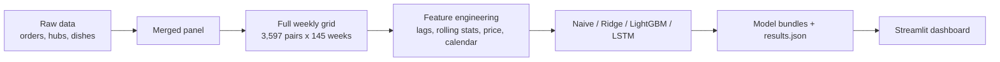

# DemandOps — Decentralized Fulfillment Demand Forecasting

[](https://foodops-demand.streamlit.app/)
[](https://www.python.org/)
[](https://lightgbm.readthedocs.io/)
[](https://pytorch.org/)
[](#6-models--benchmark-scoreboard)
[](https://foodops-demand.streamlit.app/)

**DemandOps** is the demand-forecasting module of **FoodOps.AI**. It forecasts weekly order volume for every dish at every fulfillment hub, using 145 weeks of history across **77 hubs, 51 dishes and 3,597 active hub–dish pairs**, and serves the forecasts through an interactive planning dashboard.

It is built for cloud-kitchen managers and supply-chain planners who need to decide **how much to prepare** for each dish: too much means spoiled ingredients and wasted labor, too little means stockouts and cancelled orders.

> 🚀 **Live Application:** [https://foodops-demand.streamlit.app/](https://foodops-demand.streamlit.app/)

### At a Glance

| | |
| :--- | :--- |
| **Task** | Weekly order forecast per (hub, dish), up to 10 weeks ahead |
| **Data** | 456,548 recorded hub–dish–week rows, ≈119.6M orders, weeks 1–145 |
| **Deployed model** | LightGBM, L1 objective on log-transformed orders, 20 features |
| **Validation WAPE** | **28.61%** (naive last-week baseline: 41.96%, a **31.8% relative reduction**) |
| **Models compared** | Naive lag-1 → Ridge → LightGBM → LSTM |
| **Dashboard** | 10-week forecast planner, price and promotion what-if analysis, model benchmarks, portfolio analytics |

---

## Table of Contents

1. [Executive Summary & Operational Context](#1-executive-summary--operational-context)
2. [Problem Formulation & Metrics](#2-problem-formulation--metrics)
3. [Dataset & Validation Strategy](#3-dataset--validation-strategy)
4. [Exploratory Findings](#4-exploratory-findings)
5. [Feature Engineering Pipeline](#5-feature-engineering-pipeline)
6. [Models & Benchmark Scoreboard](#6-models--benchmark-scoreboard)
7. [Evaluation Notes & Limitations](#7-evaluation-notes--limitations)
8. [Interactive Streamlit Dashboard](#8-interactive-streamlit-dashboard)
9. [Repository & Module Layout](#9-repository--module-layout)
10. [Local Quickstart](#10-local-quickstart)
11. [Insights & Business Takeaways](#11-insights--business-takeaways)

---

## 1. Executive Summary & Operational Context

In on-demand food delivery, the weekly prep decision per dish sits at the core of both profitability and customer experience:

- **The cost of over-forecasting:** perishable ingredient spoilage, wasted prep labor, cold-storage overload.
- **The cost of under-forecasting:** kitchen stockouts, cancelled orders, delayed dispatch and lost repeat customers.

DemandOps turns the weekly order history of each hub–dish pair into a calibrated forward forecast. It benchmarks four modeling paradigms of increasing complexity (a heuristic, a regularized linear model, gradient-boosted trees and a sequential neural network), selects the champion on a time-based hold-out, and packages it into a dashboard where planners can edit the next ten weeks of prices and promotions and see the resulting demand and prep quantities.


```mermaid
flowchart LR
    A["Raw data<br/>orders, hubs, dishes"] --> B["Merged panel"]
    B --> C["Full weekly grid<br/>3,597 pairs x 145 weeks"]
    C --> D["Feature engineering<br/>lags, rolling stats, price, calendar"]
    D --> E["Naive / Ridge / LightGBM / LSTM"]
    E --> F["Model bundles + results.json"]
    F --> G["Streamlit dashboard"]
```

---

## 2. Problem Formulation & Metrics

- **Target:** weekly demand $\mathrm{num\_orders}_{c,m,t}$ for hub $c$, dish $m$ and week $t$.
- **Forecast horizon:** the dashboard produces a 10-week plan (weeks 146–155 given the data cutoff at week 145).
- **Target transformation:** order counts are heavily right-skewed, so models predict the log-transformed target and the output is inverted and clipped at zero:

  $$y_{\log} = \log(1 + \mathrm{num\_orders}) \qquad \widehat{\mathrm{num\_orders}} = \max\left(0, \exp(\hat{y}_{\log}) - 1\right)$$

- **Training objective:** L1 (absolute error) on the log target for LightGBM and the LSTM, which aligns with the absolute-error metric below.

### Metrics

$$\text{WAPE} = \frac{\sum_i |y_i - \hat{y}_i|}{\sum_i y_i} \times 100 \qquad \text{MAPE} = \frac{1}{N}\sum_i \frac{|y_i - \hat{y}_i|}{y_i} \times 100 \qquad \text{Bias} = \left(\frac{\sum_i \hat{y}_i}{\sum_i y_i} - 1\right) \times 100$$

| Metric | Why it is reported |
| :--- | :--- |
| **WAPE** (primary KPI) | Volume-weighted, so a 20-unit miss on a 500-order staple matters more than the same miss on a 2-order dish. It reflects total kitchen impact. |
| **MAPE** | Item-level view. It is unstable at low volumes (predicting 3 against an actual of 1 is a 200% error), so it is read as a secondary signal. |
| **Bias** | Total forecast against total actual. Negative means under-forecasting (stockout risk), positive means over-forecasting (waste). WAPE alone cannot show this direction. |

---

## 3. Dataset & Validation Strategy

- **Source:** [Food Demand Forecasting (Kaggle)](https://www.kaggle.com/datasets/kannanaikkal/food-demand-forecasting)

| File | Contents |
| :--- | :--- |
| `train.csv` | 456,548 rows, weeks 1–145: `center_id`, `meal_id`, `week`, `checkout_price`, `base_price`, `emailer_for_promotion`, `homepage_featured`, `num_orders` |
| `fulfilment_center_info.csv` | 77 hubs: `city_code`, `region_code`, `center_type` (TYPE_A/B/C), `op_area` (km²) |
| `meal_info.csv` | 51 dishes: `category` (14 categories), `cuisine` (4 cuisines) |
| `test.csv` | Planned prices and promotions for weeks 146–155, with no order counts. Used by the dashboard to pre-fill the planning table. |

The raw table has no duplicates or missing values. Of the 3,927 possible hub–dish combinations, 3,597 ever appear in the data.

### Time-Based Validation Split

Random $k$-fold validation would let the model see future weeks while predicting the past. DemandOps uses a strict chronological hold-out instead:

```
[=================== TRAIN: weeks 1 to 131 ===================][== VALIDATION: weeks 132 to 145 ==]   [== FORECAST: weeks 146 to 155 ==]
                                                               ↑                                         (planned inputs only, no actuals)
                                                         Cutoff: week 131
```

| Partition | Weeks | Grid rows | Role |
| :--- | :---: | :---: | :--- |
| Train | 1–131 | 471,207 | Model fitting |
| Validation | 132–145 | 50,358 | Scoring and model comparison |
| Forecast | 146–155 | n/a | Dashboard planning horizon (no labels) |

The LightGBM model served by the dashboard is refit on all 145 weeks with the same parameters once the comparison is complete.

---

## 4. Exploratory Findings

Analysis lives in [`notebooks/EDA.ipynb`](./notebooks/EDA.ipynb).

- **Skewed demand.** Orders per row average 262 with a median of 136; the 25th and 75th percentiles are 54 and 324, and the maximum is 24,299. This motivates the log transform.
- **Minimum of 13.** No recorded row has fewer than 13 orders, so recorded demand never shows a tail of very small counts. This matters for how missing weeks are interpreted (see [Section 5](#5-feature-engineering-pipeline)).
- **Promotions lift demand sharply.** Average orders per row by promotion state:

  | Email promo | Homepage featured | Avg. orders | Rows | Lift vs. no promotion |
  | :---: | :---: | ---: | ---: | ---: |
  | No | No | 211.4 | 388,874 | baseline |
  | No | Yes | 455.9 | 30,624 | +115.6% |
  | Yes | No | 431.3 | 17,819 | +104.0% |
  | Yes | Yes | 816.2 | 19,231 | +286.1% |

  These are raw group means, not controlled estimates: promoted dishes may also be inherently popular.
- **Discounts vary in both directions.** The discount distribution (base vs. checkout price) includes markups as well as discounts, so the price signal is a signed percentage change.
- **Incomplete weekly grid.** 456,548 recorded rows against 521,565 possible (hub, dish, week) cells means 65,017 cells (12.5%) have no recorded order, which shapes the feature design below.

---

## 5. Feature Engineering Pipeline

Implemented in [`notebooks/feature_engineering.ipynb`](./notebooks/feature_engineering.ipynb).

### 5.1 Full weekly grid

Lag features require "the previous week" to mean the previous calendar week. Because the raw data only contains a row when orders were recorded, shifting by row position would silently pull values from the wrong week. The panel is therefore expanded to a complete grid of the 3,597 real pairs by 145 weeks (**521,565 rows**) before any lag is computed.

> **Assumption.** Cells with no recorded order are filled with `num_orders = 0`. Static attributes and prices on those cells are filled within the pair, and promotion flags default to 0. The gaps are not evenly spread: they are about 13.6% of cells in weeks 1–131 against 2.1% in weeks 132–145. The zero-fill is a modeling choice, not a measured fact. See [Section 7](#7-evaluation-notes--limitations).

### 5.2 Features (20 in the final model)

| Group | Features | Definition |
| :--- | :--- | :--- |
| **Autoregressive lags** | `lag_1`, `lag_2`, `lag_4` | $\log(1+\text{orders})$ one, two and four weeks earlier |
| **Rolling statistics** | `rolling_mean_4`, `rolling_std_4` | Mean and sample standard deviation of the previous four weeks (shifted by one week *before* rolling, so a row never sees its own week) |
| **Pricing** | `checkout_price`, `base_price`, `price_change_pct` | `price_change_pct = (checkout_price − base_price) / base_price` |
| **Promotions** | `emailer_for_promotion`, `homepage_featured` | Binary marketing flags for the target week |
| **History flag** | `new_centre_meal` | 1 when fewer than four prior weeks exist (the first four weeks of the panel) |
| **Calendar** | `week_of_year` | $((\text{week}-1) \bmod 52) + 1$ |
| **Entity metadata** | `center_id`, `meal_id`, `city_code`, `region_code`, `center_type`, `category`, `cuisine`, `op_area` | Hub and dish identity and attributes (categoricals handled natively by LightGBM) |

Missing history at the start of each pair (lags and rolling statistics) is filled with 0 and flagged by `new_centre_meal`.

### 5.3 Leakage control

- Every history feature is built on the shifted series and grouped by (hub, dish), so nothing crosses pairs or sees the current week.
- Scaling statistics (Ridge pipeline, LSTM inputs) are computed on training weeks only.
- Validation weeks are scored strictly after the training cutoff.

---

## 6. Models & Benchmark Scoreboard

All models are trained on weeks 1–131 and scored on the same 50,358 validation rows (weeks 132–145), one week ahead with true history available.

| Rank | Model | Family | WAPE (%) | MAPE (%) | Bias (%) | Role |
| :---: | :--- | :--- | :---: | :---: | :---: | :--- |
| 🥇 | **LightGBM** (L1 objective) | Gradient Boosted Trees | **28.61** | **43.84** | −6.37 | **Champion (deployed)** |
| 🥈 | **LSTM** | Deep Learning (PyTorch) | 29.85 | 50.79 | **−1.70** | Challenger |
| 🥉 | **Ridge Regression** | L2-Regularized Linear Model | 35.42 | 48.91 | −3.19 | Linear baseline |
| 4 | **Naive Lag-1** | Heuristic | 41.96 | 67.23 | +2.08 | Lower bound |

### Model details

- **Naive lag-1.** Repeats last week's orders.
- **Ridge Regression.** scikit-learn pipeline on the log target with $\alpha = 1$: standardized numeric features (including `week` as a linear trend and sine/cosine encodings of `week_of_year`), passthrough binary flags and one-hot encoded identifiers and categories.
- **LightGBM.** Native categorical handling, L1 objective on the log target, 2,000 trees, learning rate 0.05, 63 leaves, `min_child_samples=100`, row and column subsampling of 0.8, L2 regularization of 1.0, seed 42. Validation L1 was still improving slowly at 2,000 trees, with no overfitting signal.
- **LSTM.** Each sample is a 16-week window of a pair's recent weeks (scaled log orders, price change, log price, promotion flags and a validity flag for padded weeks) passed through a 2-layer LSTM with 128 hidden units. The final hidden state is concatenated with the target week's known covariates (price, promotions, season) and learned embeddings of hub (16 dimensions) and dish (8 dimensions), then fed to a small dense head. Trained with L1 loss and AdamW.

  | Setting | Value |
  | :--- | :--- |
  | History window | 16 weeks |
  | LSTM layers / hidden units | 2 / 128 |
  | Embedding dimensions (hub / dish) | 16 / 8 |
  | Dropout | 0.001 |
  | Learning rate / weight decay | 2.6e-3 / 4.3e-5 |
  | Batch size | 512 |

  These settings come from trial runs compared on weeks 118–131 (inside the training period); the selected configuration was refit on weeks 1–131 and scored once on weeks 132–145. The final configuration is stored in `models/lstm_config.json`.

### Performance analysis

- **Each rung up to LightGBM helps.** Ridge cuts WAPE by 6.54 points against the naive baseline and LightGBM by a further 6.81 points, **13.35 points in total (a 31.8% relative reduction)**.
- **LightGBM vs. LSTM.** LightGBM leads by 1.24 WAPE points and is clearly better at the item level (MAPE 43.84% vs. 50.79%). The LSTM is closer to unbiased on total volume (−1.70% vs. −6.37%). The tree model also needs no sequence construction, so it is simpler to serve.
- **Sign of the bias.** All three learned models under-forecast total volume, a pattern consistent with training on the log scale: LightGBM's L1 objective targets the conditional median and Ridge's squared loss on logs targets a geometric-mean-like center, and both sit below the arithmetic mean of right-skewed demand. The size of the effect differs by model (−6.37% for LightGBM, −1.70% for the LSTM).

### LightGBM feature importance (gain)

| Rank | Feature | Gain (millions) |
| :---: | :--- | ---: |
| 1 | `rolling_mean_4` | 8.42 |
| 2 | `meal_id` | 6.32 |
| 3 | `week_of_year` | 1.99 |
| 4 | `center_id` | 1.68 |
| 5 | `lag_1` | 1.61 |
| 6 | `rolling_std_4` | 1.27 |
| 7 | `category` | 1.25 |
| 8 | `checkout_price` | 0.46 |

Recent demand level and dish identity dominate. The promotion flags rank below the history features because the recent level already carries much of the recent promotional effect.

---

## 7. Evaluation Notes & Limitations

- **One-week-ahead scores.** The scoreboard measures forecasts made with true history available. The dashboard's multi-week plan is recursive (each predicted week feeds the next week's lags), so accuracy beyond week 1 is expected to be lower.
- **Scoring population.** Validation covers all 50,358 grid rows for weeks 132–145. About 2% of those are empty cells with an actual of zero; they are included in WAPE and Bias and skipped in MAPE (undefined at zero).
- **Mildly optimistic LightGBM score.** The validation weeks were used to configure early stopping and for a small number of manual parameter trials, so 28.61% is slightly flattered. The LSTM settings were instead chosen on weeks 118–131 and scored once on weeks 132–145.
- **Zero-fill assumption.** Empty cells are treated as zero demand in the lag features. Alternative treatments (for example leaving them missing) were not evaluated.
- **Limited seasonality evidence.** With about 2.8 yearly cycles, `week_of_year` can capture repeating patterns but also act as a time marker, and it ranks third by gain. Its contribution was not ablated.
- **Price and promotion curves are observational.** The what-if charts show what the model learned from historical data, not causal elasticities. Read direction, not decimals.
- **Under-forecasting.** Bias of −6.4% should be offset deliberately: the dashboard's prep buffer exists for this purpose.

---

## 8. Interactive Streamlit Dashboard

> 🌐 **Live Cloud Deployment:** [https://foodops-demand.streamlit.app/](https://foodops-demand.streamlit.app/)

Implemented in [`app/streamlit_app.py`](./app/streamlit_app.py) with a theme that adapts to light and dark mode.

### Tab 1: Forecast & What-If Simulator

1. **Hub and dish selection.** Only dishes that the chosen hub has actually sold are listed. The panel shows the latest recorded orders and warns when recent weeks have no recorded orders.
2. **10-week planning table.** Editable base price, checkout price, email and homepage flags for each future week, pre-filled from the official plan in `test.csv` where available.
3. **Forecast output.** Week-1 forecast with change versus last week, 10-week total, prep quantity (forecast plus an adjustable safety buffer, default 15%) and estimated revenue. A chart shows 26 weeks of recorded history and the forecast, with a typical error range at week 1.
4. **Price elasticity.** Next-week demand and revenue across ±30% price changes, with the revenue-maximizing price marked.
5. **Promotion lift.** Next-week demand under no promotion, email only, homepage only and both.
6. **Transparency panels.** The exact model inputs for the first forecast week and notes on how to read the forecast.

### How the forecast is produced

Features are rebuilt from each pair's history using the same definitions as the training pipeline. Week 1 uses true history; each following week appends the previous prediction to the history before computing its lags. The typical error range at week 1 is the 10th–90th percentile of actual/forecast ratios on the validation weeks.

At start-up the app rebuilds lag, rolling, calendar and price features for a sample of pairs and weeks, compares them with the saved feature table, and **refuses to run if they differ**, so training and serving cannot drift apart silently.

### Tab 2: Model Benchmarks & Evaluation

Scoreboard read from `models/results.json` (WAPE, MAPE, bias), side-by-side metric charts and the top LightGBM features by gain share.

### Tab 3: Portfolio & Kitchen Analytics

Network KPIs, demand composition by category and cuisine, the weekly order trajectory and a data-coverage chart showing the share of hub–dish pairs with a recorded order in each week.

---

## 9. Repository & Module Layout

```text
DemandOps/
├── README.md                          ← Module documentation (this file)
├── app/
│   ├── streamlit_app.py               ← Dashboard: planner, what-if, benchmarks, analytics
│   └── theme.py                       ← Light/dark theme tokens and chart styling
├── dataset/
│   ├── raw/
│   │   ├── train.csv
│   │   ├── test.csv                   ← Planned inputs for weeks 146–155
│   │   ├── fulfilment_center_info.csv
│   │   └── meal_info.csv
│   └── processed/
│       ├── merged_data.parquet        ← Raw tables merged (recorded rows only)
│       └── feature_engineered_data.parquet  ← Full weekly grid with all features
├── models/
│   ├── lgb_final_bundle.joblib        ← Deployed LightGBM (refit on weeks 1–145)
│   ├── lgb_bundle.joblib              ← Validated LightGBM (weeks 1–131)
│   ├── lgb_val_pred.parquet           ← Validation predictions (error range in the app)
│   ├── ridge_bundle.joblib            ← Ridge pipeline
│   ├── lstm_bundle.pt                 ← LSTM weights and input metadata
│   ├── lstm_val_pred.parquet          ← LSTM validation predictions
│   ├── lstm_config.json               ← Final LSTM configuration
│   └── results.json                   ← Scoreboard consumed by the dashboard
├── notebooks/
│   ├── EDA.ipynb                      ← Profiling, promotion and discount analysis
│   ├── feature_engineering.ipynb      ← Weekly grid, lags, rolling stats, calendar
│   └── model_training.ipynb           ← Naive, Ridge, LightGBM, LSTM evaluation
└── src/
    ├── data_loader.py                 ← Panel, scoreboard and analytics loaders
    └── inference.py                   ← Feature rebuilding, recursive forecasting, parity check
```

The dashboard reads `lgb_final_bundle.joblib` (falling back to `lgb_bundle.joblib`), `lgb_val_pred.parquet`, `results.json`, the processed panel and, optionally, `test.csv`. The LSTM is evaluated offline: `model_training.ipynb` loads its saved artifacts and scores its validation predictions, and the dashboard serves LightGBM.

---

## 10. Local Quickstart

### Prerequisites

- Python 3.12
- A virtual environment (`venv` or `conda`)

### Step 1: Clone and create an environment

```bash
git clone https://github.com/iamnitishsah/FoodOps.AI.git
cd FoodOps.AI

python3.12 -m venv .venv
source .venv/bin/activate    # On Windows: .venv\Scripts\activate
```

### Step 2: Install dependencies

```bash
pip install --upgrade pip
pip install -r requirements.txt
```

### Step 3: Launch the dashboard

```bash
streamlit run DemandOps/app/streamlit_app.py
```

The app opens at `http://localhost:8501`.

### Reproducing the analysis

Place the Kaggle files in `DemandOps/dataset/raw/` and run the notebooks in order: `EDA_v1.ipynb` → `feature_engineering_v1.ipynb` → `model_training.ipynb`. The training notebook skips any model whose saved bundle matches the current features and parameters, and re-fits it when they change.

---

## 11. Insights & Business Takeaways

1. **Recent level is the strongest signal.** The four-week rolling mean and dish identity account for the largest share of LightGBM's gain. Planning from recent run-rate is a strong baseline, and the model's job is to adjust it for price, promotion and calendar effects.
2. **Complexity pays up to a point.** Moving from a naive baseline to a linear model to gradient-boosted trees each cut WAPE substantially, while the LSTM did not improve on LightGBM. For this tabular, short-history problem, the simpler tree model won on accuracy and on simplicity of serving.
3. **Promotions are the biggest lever.** Raw averages show roughly doubled demand with either channel and nearly four-fold with both, so promoted weeks need advance batch preparation to avoid stockouts.
4. **Know your bias.** Two models can have similar WAPE and very different bias. The LSTM is nearly unbiased on total volume while LightGBM under-forecasts by about 6%; planners should choose the safety buffer with that in mind.
5. **Gaps in the data are informative.** Empty hub–dish weeks are concentrated early in the history, so how they are treated is a real modeling decision, and one worth testing explicitly.
