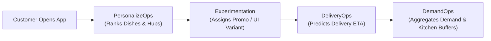

# FoodOps.AI

[](https://www.python.org/)
[](https://foodops-ai-demandops.streamlit.app/)
[](./LICENSE)
[](https://foodops-ai-demandops.streamlit.app/)

**FoodOps.AI** is an enterprise-grade food delivery machine learning platform built around four independent, self-contained operational intelligence modules: **demand forecasting**, **delivery time (ETA) prediction**, **personalized menu recommendation**, and **experimentation / causal inference**.

Each module solves a high-impact operational decision problem using real-world or realistically simulated data, progressing from exploratory data analysis and simple baselines to production-grade ML architectures and interactive operations consoles.

> 🚀 **DemandOps Live Cloud Application:** [https://foodops-ai-demandops.streamlit.app/](https://foodops-ai-demandops.streamlit.app/)

---

## Module Status Overview

| Module | Operational Domain | Primary Modeling Paradigm | Benchmark KPI | Status | Live Console / Documentation |
| :--- | :--- | :--- | :---: | :---: | :--- |
| **Module 1: DemandOps** | Weekly Fulfillment Demand Forecasting | LightGBM GBDT, PyTorch LSTM, Ridge | **28.75% WAPE** | 🟢 **Complete & Deployed** | [Live App](https://foodops-ai-demandops.streamlit.app/) · [DemandOps README](./DemandOps/README.md) |
| **Module 2: DeliveryOps** | Real-Time Order Delivery ETA Prediction | Gradient Boosted Trees & Uncertainty Intervals | MAE / P90 Error | 🟡 Queued (Next) | [DeliveryOps README](./DeliveryOps/README.md) |
| **Module 3: PersonalizeOps** | Implicit Feedback Dish & Restaurant Ranking | Matrix Factorization & Two-Tower Embeddings | NDCG@10 / Recall@10 | ⚪ Queued | [PersonalizeOps README](./PersonalizeOps/README.md) |
| **Module 4: Experimentation** | A/B Test Harness & Causal Inference | Frequentist/Bayesian Testing, DiD, Matching | SRM / Uplift / Power | ⚪ Queued | [Experimentation README](./Experimentation/README.md) |

---

## Table of Contents

- [What This Repository Is](#what-this-repository-is)
- [Module 1: DemandOps (Demand Forecasting)](#module-1-demandops-demand-forecasting)
- [Module 2: DeliveryOps (ETA Prediction)](#module-2-deliveryops-eta-prediction)
- [Module 3: PersonalizeOps (Recommendation Engine)](#module-3-personalizeops-recommendation-engine)
- [Module 4: Experimentation (Experimentation Framework)](#module-4-experimentation-experimentation-framework)
- [Repository Structure](#repository-structure)
- [Why Modules Are Independent](#why-modules-are-independent)
- [Build Order](#build-order)
- [Planned Integration Layer](#planned-integration-layer)
- [Tech Stack](#tech-stack)
- [Quickstart & Local Execution](#quickstart--local-execution)

---

## What This Repository Is

A food-delivery platform (riders, restaurants, orders, zones) generates distinct operational decisions that data science can inform:
1. **How much food demand to expect** at each fulfillment center to prevent spoilage and kitchen stockouts (*Time Series Forecasting*).
2. **How long a delivery will take** to set realistic customer expectations and dispatch couriers efficiently (*Tabular Regression & Uncertainty Estimation*).
3. **What dishes and restaurants to recommend** to optimize customer conversion (*Implicit Recommendation & Deep Ranking*).
4. **Whether a commercial or product change actually worked** without being misled by confounders or sample ratio mismatch (*Causal Inference & A/B Testing*).

Because these four decision types belong to fundamentally different problem families, FoodOps.AI structures them as independent modules rather than forcing an artificial unified abstraction.

Each module:
- Formulates a concrete operational problem with domain-specific KPIs.
- Uses public benchmark datasets or rigorous simulations reflecting real operational scale.
- Builds an incremental modeling progression (Heuristic $\to$ Linear $\to$ Deep Learning $\to$ Gradient Boosted Trees).
- Deploys an interactive Streamlit operations application allowing non-technical stakeholders to simulate scenarios and audit benchmarks.

---

## Module 1: DemandOps (Demand Forecasting)

**Status:** 🟢 **Complete & Live Deployed**  
**Detailed Documentation:** [`DemandOps/README.md`](./DemandOps/README.md)  
**Interactive Live Console:** [https://foodops-ai-demandops.streamlit.app/](https://foodops-ai-demandops.streamlit.app/)

### Operational Problem
Decentralized fulfillment centers face a severe tradeoff: over-predicting weekly dish demand leads to perishable food waste and cold-chain storage overload; under-predicting causes kitchen stockouts, canceled orders, and delayed deliveries. DemandOps forecasts weekly order volume (`num_orders`) for each `(center_id, meal_id)` combination across a decentralized fulfillment center network (77 hubs, 51 dishes, 14 categories, 4 cuisines, 119.5M historical meals).

- **Primary Dataset Source:** [Food Demand Forecasting (Kaggle)](https://www.kaggle.com/datasets/kannanaikkal/food-demand-forecasting)

### Technical Highlights
- **Leakage-Free Temporal Validation:** Trained strictly on historical weeks 1 to 131 and evaluated on unseen hold-out weeks 132 to 145 (14 continuous weeks) to prevent lookahead bias.
- **Supply Chain Feature Engineering:** Autoregressive lags (`lag_1`, `lag_2`, `lag_4`), 4-week rolling statistics (`rolling_mean_4`, `rolling_std_4`), non-linear discount elasticity (`price_change_pct`), promotional indicators (`emailer_for_promotion`, `homepage_featured`), calendar seasonality (`week_of_year`), and center/meal categorical metadata.
- **Target Transformation:** Trained on $\log(1 + \mathrm{num\_orders})$ for variance stabilization, with inverted non-negative predictions $\max(0, \exp(\hat{y}) - 1)$.
- **Autoregressive Multi-Step Roll-Forward Engine:** Iterative state-lookup engine predicting 32,573 rows for out-of-sample forward horizon weeks 146–155 ([`submission_lgb.csv`](./DemandOps/data/processed/submission_lgb.csv)) with 0 missing or negative values.

### Model Benchmark Scoreboard

| Rank | Model Architecture | Model Family | Validation WAPE (%) | Validation MAPE (%) | Operational Role |
| :---: | :--- | :--- | :---: | :---: | :--- |
| 🥇 | **LightGBM Regressor** | Gradient Boosted Decision Trees | **28.75%** | **44.14%** | **Champion (Production Deployed)** |
| 🥈 | **Simple LSTM** | Deep Learning (PyTorch) | **29.98%** | **44.02%** | Challenger Model |
| 🥉 | **Ridge Regression** | L2-Regularized Linear Model | **35.72%** | **46.98%** | Linear Baseline |
| 4 | **Naive Lag-1 Baseline** | Heuristic Benchmark | **41.96%** | **67.23%** | Lower Bound Benchmark |

*Primary KPI: Volume-Weighted Absolute Percentage Error (WAPE) — weights prediction errors by order volume so high-demand kitchen staples are prioritized over low-volume outliers.*

### Streamlit Operations Console Features
- **Live Demand Prediction & Buffer Calculator:** Real-time inference across 77 fulfillment centers and 51 catalog meals with automated +15% kitchen safety prep stock and 80% confidence interval.
- **Price Elasticity & Revenue Sensitivity Curve:** Interactive price sweep from $-30\%$ to $+30\%$ identifying the exact revenue-maximizing checkout price.
- **Promotional Channel Lift Simulator:** Quantifies individual and combined demand uplifts for Email campaigns vs. Homepage app carousels.
- **Model Scoreboard & Feature Importance:** Live error metrics comparison and top 12 predictive features (splits & gain).
- **Portfolio & Kitchen Analytics:** Historical meal category distributions, cuisine demand shares, and multi-year weekly network volume trajectories.

---

## Module 2: DeliveryOps (ETA Prediction)

**Status:** 🟡 Queued (Next Module)  
**Folder:** [`DeliveryOps/`](./DeliveryOps/README.md)

### Operational Problem
Predict total order delivery duration (order placed $\to$ customer doorstep) given distance, time of day, weather, traffic congestion, and kitchen preparation load. 

### What's Involved:
- Spatial feature engineering (haversine/OSRM routing distances, zone clustering).
- Gradient boosted regression models with calibrated prediction intervals (P10, P50, P90) to provide customer-facing delivery promises.
- Error decomposition by delivery segment (rush hour vs. off-peak, extreme weather vs. clear).
- Interactive dispatch and ETA simulator in Streamlit.

---

## Module 3: PersonalizeOps (Recommendation Engine)

**Status:** ⚪ Queued  
**Folder:** [`PersonalizeOps/`](./PersonalizeOps/README.md)

### Operational Problem
Rank dishes and restaurants for users based on sparse, implicit interaction histories (orders, re-orders, impressions).

### What's Involved:
- Implicit interaction matrix construction and popularity baselines.
- Classical collaborative filtering (Matrix Factorization / Implicit ALS).
- Deep two-tower neural network in PyTorch (User Tower + Dish/Restaurant Tower).
- Ranking evaluation: NDCG@k, Precision@k, Recall@k, and coverage.
- Cold-start handling for new consumers and newly onboarded kitchens.

---

## Module 4: Experimentation (Experimentation Framework)

**Status:** ⚪ Queued  
**Folder:** [`Experimentation/`](./Experimentation/README.md)

### Operational Problem
Evaluate whether product interventions (pricing changes, algorithm updates, delivery fee adjustments) drive statistically significant and causal business improvements.

### What's Involved:
- Minimum detectable effect (MDE) and sample size calculations.
- Rigorous hypothesis testing with guardrails against common experimentation pitfalls (peeking, Sample Ratio Mismatch, multiple comparisons).
- Observational causal inference (Difference-in-Differences, Propensity Score Matching) for network-wide policy changes where randomized A/B splits cannot be isolated.
- Interactive experiment diagnostics dashboard in Streamlit.

---

## Repository Structure

```
FoodOps.AI/
├── README.md                          ← Main platform overview (this file)
├── requirements.txt                   ← Pinned project dependencies
├── LICENSE                            ← MIT license
│
├── DemandOps/                         ← Module 1: Demand Forecasting (Complete & Live)
│   ├── README.md                      ← Comprehensive module documentation & results
│   ├── app/
│   │   ├── streamlit_app.py           ← Interactive Streamlit operations console
│   │   └── theme.py                   ← Theme tokens & responsive Plotly configurations
│   ├── data/
│   │   ├── raw/                       ← Fulfillment center, meal, train & test CSVs
│   │   └── processed/                 ← Engineered panels, state caches & submission
│   ├── models/
│   │   ├── lgb_model.joblib           ← Serialized LightGBM regressor
│   │   └── lgb_model_bundle.joblib    ← Production bundle (model, feature contract, metadata)
│   ├── notebooks/
│   │   ├── EDA.ipynb                  ← Exploratory data analysis
│   │   ├── feature_engineering.ipynb  ← Panel generation & temporal feature engineering
│   │   ├── model_training.ipynb       ← 4-model benchmarking (Naive, Ridge, LightGBM, LSTM)
│   │   └── test_evaluation.ipynb      ← Autoregressive multi-step roll-forward evaluation
│   └── src/
│       ├── data_loader.py             ← Cached loaders for metadata & summaries
│       └── inference.py               ← Single-row inference, elasticity & promo simulations
│
├── DeliveryOps/                       ← Module 2: ETA Prediction (Queued)
│   ├── README.md
│   ├── app/
│   ├── data/{raw,processed}/
│   ├── models/
│   ├── notebooks/
│   └── src/
│
├── PersonalizeOps/                    ← Module 3: Recommendation Engine (Queued)
│   ├── README.md
│   ├── app/
│   ├── data/{raw,processed}/
│   ├── models/
│   ├── notebooks/
│   └── src/
│
└── Experimentation/                   ← Module 4: Experimentation Framework (Queued)
    ├── README.md
    ├── app/
    ├── data/{raw,processed}/
    ├── notebooks/
    └── src/
```

---

## Why Modules Are Independent

Each module maintains its own dedicated `data/`, `models/`, `notebooks/`, `src/`, and `app/` subdirectories. This architecture ensures:
- **Zero Coupling:** Each operational domain can be explored, run, trained, and audited in complete isolation.
- **No Premature Abstraction:** Machine learning problems in time series, spatial regression, collaborative filtering, and causal inference require distinct schemas, preprocessing pipelines, and evaluation harnesses.
- **Plug-and-Play Production:** Every module’s Streamlit console functions as an independent micro-frontend that can be deployed standalone or embedded into an enterprise operations portal.

---

## Build Order

Development proceeds across four sequential operational stages:

1. **DemandOps (Demand Forecasting)** — **Complete & Live Deployed**: Core supply chain foundation. Ingested 145 weeks of fulfillment transactions, engineered temporal lags, benchmarked 4 models (28.75% WAPE), executed autoregressive roll-forward test inference, and deployed the interactive Streamlit dashboard.
2. **DeliveryOps (ETA Prediction)** — Predict customer delivery duration based on route distance, weather, and fulfillment load with calibrated uncertainty intervals.
3. **PersonalizeOps (Recommendation Engine)** — Rank dishes and restaurants for users based on sparse, implicit interaction histories using matrix factorization and deep two-tower architectures.
4. **Experimentation (A/B Testing & Causal Inference)** — Establish the statistical experimentation harness to evaluate changes (recommendations, pricing, dispatch rules) with guardrail checks against sample ratio mismatch and novelty effects.

---

## Planned Integration Layer

Once all four standalone modules are completed, an optional cross-module integration workflow will connect them:



---

## Tech Stack

| Category | Tools & Libraries |
|---|---|
| **Core Language** | Python 3.12 |
| **Data Processing & Storage** | pandas, numpy, pyarrow, joblib |
| **Classical ML & Gradient Boosting** | LightGBM, scikit-learn |
| **Deep Learning** | PyTorch (LSTM sequence modeling) |
| **Interactive Applications** | Streamlit, Plotly Express, Plotly Graph Objects |
| **Experimentation & Statistics** | SciPy, statsmodels |
| **Deployment & Hosting** | Streamlit Community Cloud, GitHub |

---

## Quickstart & Local Execution

### 1. Clone & Setup Environment
```bash
git clone https://github.com/iamnitishsah/FoodOps.AI.git
cd FoodOps.AI

python3 -m venv .venv
source .venv/bin/activate    # On Windows: .venv\Scripts\activate
pip install -r requirements.txt
```

### 2. Launch DemandOps Operations Console
```bash
streamlit run DemandOps/app/streamlit_app.py
```
Visit `http://localhost:8501` to interact with the live forecasting dashboard, run what-if price simulations, and view model benchmarks.

### 3. Or Access the Live Cloud Deployment
The DemandOps dashboard is continuously deployed and accessible at:  
👉 **[https://foodops-ai-demandops.streamlit.app/](https://foodops-ai-demandops.streamlit.app/)**
